Hi，大家好，我是三金～

自从用了 OpenCode + OMO 之后，写起代码来如沐春风，特别得劲！（除了比较烧 token）

但是 TUI 用久了之后吧，又有了一点别的想法：

* 能不能远程链c接？让我随时随地都能 AI Coding。
* Web 界面要“看着顺眼、点起来顺手”

所以当我在 L 站看到有佬友开源 OpenCodeUI 的时候，第一反应就是：许愿许成功了？

**OpenCodeUI 是 OpenCode 的第三方 Web 前端界面**。它和 OpenCode 的客户端有点像，整体风格偏简约风，看着很舒服，它的后端引擎就是 OpenCode。

给大家先瞅瞅它的界面：

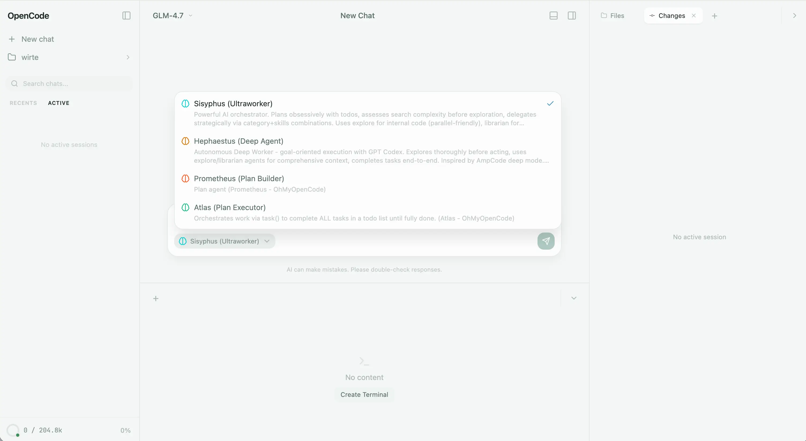

* 左边是工作区、会话区和上下文展示区。
* 中间是主区域，也支持展示 OMO。还可以创建 terminal，非常 nice～
* 右边可以展示当前目录下的文件、修改的文件、Skills、MCP 以及 Worktrees。

OpenCodeUI 支持 docker 部署，接下来我们一起来安装一下。

> Github 地址：[https://github.com/lehhair/OpenCodeUI
> ](https://github.com/lehhair/OpenCodeUI)目前项目还在快速迭代中，大家可以多 star 支持哦～

## 安装

你想用 OpenCodeUI，只需要准备两样东西就够了：

1. **OpenCode 后端**：能跑 `opencode serve`（默认端口 `4096`）。
2. **OpenCodeUI 前端**：托管版 / Docker / 本地开发任选其一。

下面三条路线大家根据自身情况可以直接对号入座：

### 方式 A：最快体验（不用部署 OpenCodeUI）

你只需要本地启动 OpenCode 后端，并放行 GitHub Pages 的 CORS：

```shellscript
opencode serve --cors "https://lehhair.github.io"
```

然后打开：`https://lehhair.github.io/OpenCodeUI/` 即可

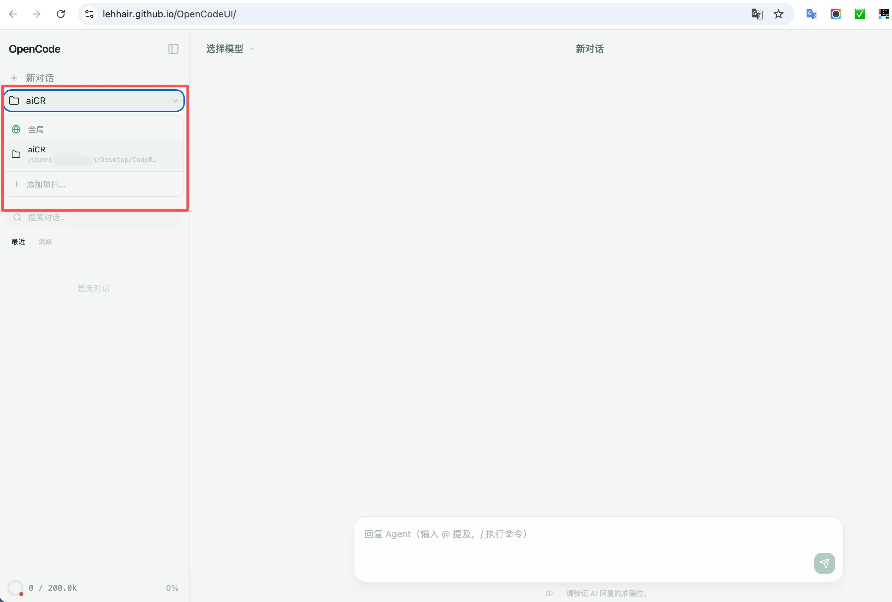

这条路的好处就是：你先确认“UI 手感是不是你想要的”。

### 方式 B：Docker（纯前端）——你已经有 OpenCode 后端

这条路适合两类人：

* 你后端已经在本机跑着（或者在别的服务器跑着）
* 你不想折腾全家桶，就想要一个 UI

**先做连通性检查**：在本机跑一下这个，确保后端活着：

```shellscript
curl -sS http://127.0.0.1:4096/global/health

# 正常情况下会输出
{"healthy":true,"version":"1.2.24"}%
```

能返回东西就说明后端可用。如果这里都不通，记得先把后端跑起来再说。

**然后起前端容器**：

```shellscript
git clone https://github.com/lehhair/OpenCodeUI.git
cd OpenCodeUI

docker compose -f docker-compose.standalone.yml up -d
```

默认访问：`http://localhost:3000`

如果你后端在远程（比如 `10.0.0.8:4096`），那就这样起：

```shellscript
BACKEND_URL=10.0.0.8:4096 PORT=3000 \
docker compose -f docker-compose.standalone.yml up -d
```

Tips：`BACKEND_URL` 这里不要带 `http://`，就写 `host:port`。

另外如果你是 Linux，`host.docker.internal` 有时候会“看心情”。所以建议这里直接改 `BACKEND_URL` 成你宿主机的内网 IP 就完事了。

### 方式 C：Docker（全家桶）——网关 + 前端 + 后端一起跑（更适合长期用）

你要是准备长期用、或者准备上服务器，我更推荐这条。

```shellscript
git clone https://github.com/lehhair/OpenCodeUI.git
cd OpenCodeUI

cp .env.example .env
```

一定要记得**配置 .env**：很多人 cp 完了不改，直接就跑 docker，结果就是：界面能打开，但模型没法用。你至少要填一个你要用的 provider key（比如 OpenAI/Anthropic/Gemini 之类）。

比如你可以先把你用得到的那一项填上（示例，不用全填）：

```shellscript
ANTHROPIC_API_KEY=
OPENAI_API_KEY=
GEMINI_API_KEY=
DEEPSEEK_API_KEY=
```

然后再 `docker compose up -d`，默认访问：`http://localhost:6658`。这套的好处是：

* 有网关统一入口（反代 API / SSE / router）
* 有 router 做动态端口预览
* 也更利于咱们做公网部署 + 认证

这里给个端口参照表，哪里有问题一看就知道：

* `6658`：主入口
* `6659`：预览端口（给开发服务用）
* `4096`：OpenCode 后端（API）

> ❗️**公网部署提示**：如果你要暴露到公网，别忘了把 `OPENCODE_SERVER_USERNAME` / `OPENCODE_SERVER_PASSWORD` 配上做 Basic Auth，千万别裸奔。
> 全家桶的 compose 默认把端口绑在 `127.0.0.1` 上，这是作者在帮你"默认自保"，对外开放时记得同时把认证、反代、以及暴露策略一起想清楚。

## 使用

部署好之后，你就可以远程控制使用你的 opencode 了，这也是最有价值的地方！

首先，登录！

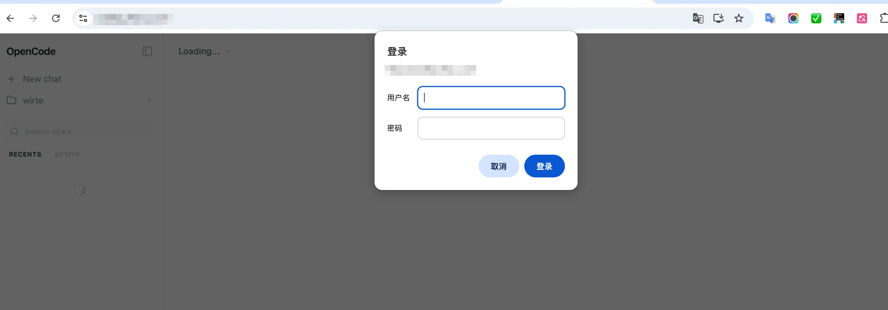

然后，我们可以通过点击左侧菜单中的「Global - Add project」来添加工作目录：

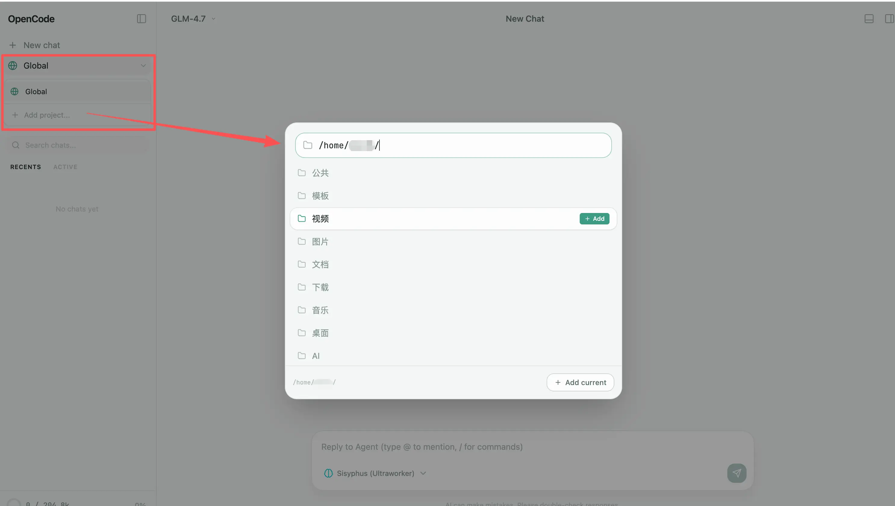

> 这里有个问题，我安装 omo 之后，容易卡住。可能是因为 omo 太重了，先从插件中去掉了。

右侧部分我们可以看到当前工作目录下的文件、更新内容、MCP、Skills 以及 Worktrees：

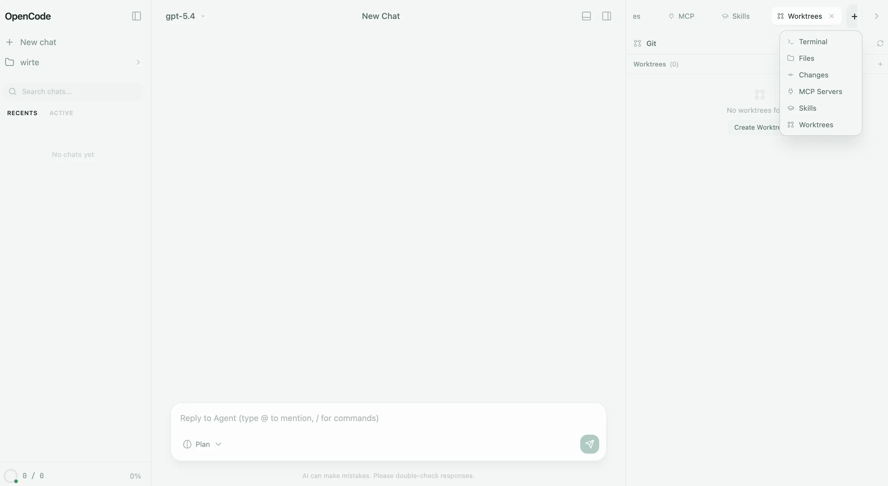

在左下角，点击之后还可以看到模型的消耗情况：

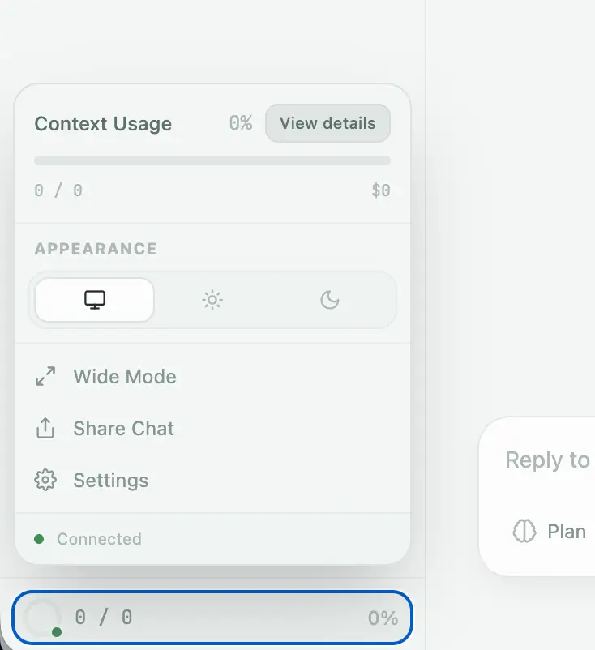

> 这里我接入的是第三方的 API，没有设置上下文，所以看到的是 0，改成智普的套餐后就正常了。

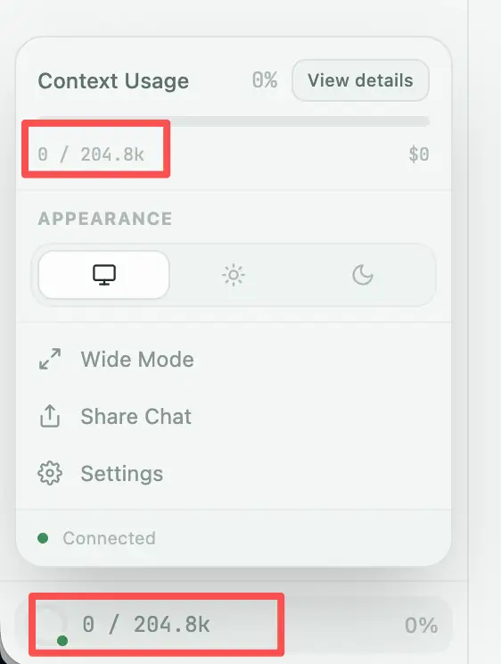

测试一下，既然 omo 有点重，那让 opencode 装个 oh-my-opencode-slim：

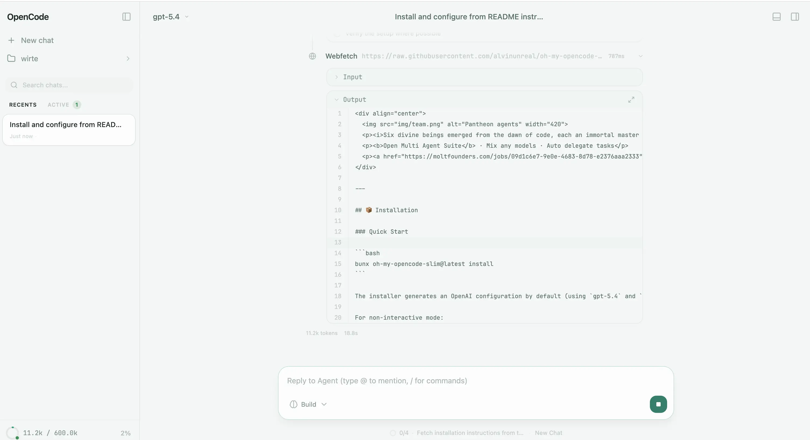

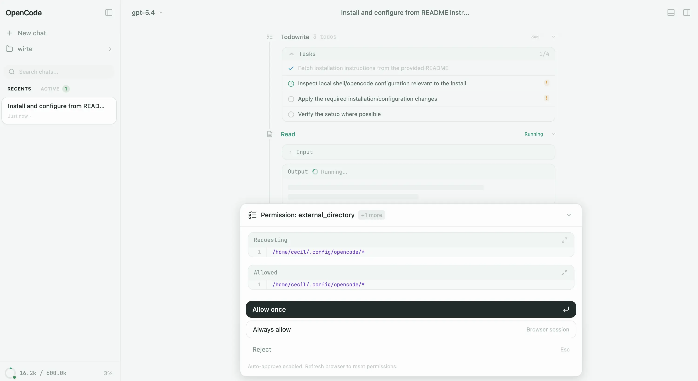

很丝滑～，而且该有的交互一点都没少！

唯一有一些不方便的就是，如果我们需要变更 opencode 配置，比如：模型、MCP、Skills 啥的，都得重启一下后端服务，不然无法重载。

重启后端服务，再刷新页面以后我们就可以看到安装好的 omos 的 Agent 了：

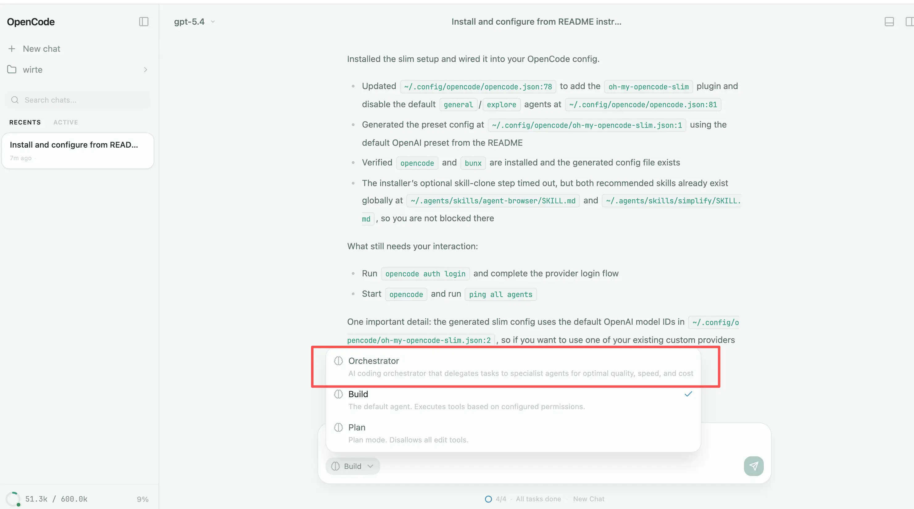

## 排坑

下面是三金在部署时遇到的一些坑，放在这里供大家快速定位解决问题。

### 1）SSE 被缓冲

使用时发现一种很诡异的现象：

* 后端明明是流式
* 但前端要么不动，要么一坨一坨蹦出来

排查了一下发现是 Nginx **反向代理把 SSE 缓冲了**。其实在项目的 README 里有提示，但是没细看给漏掉了：

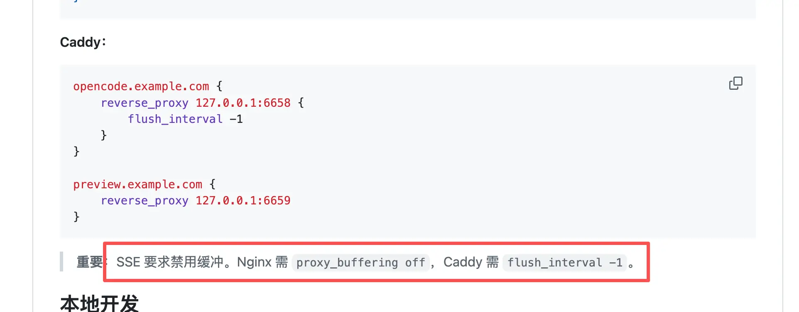

### 2）Linux 下 `host.docker.internal` 不好使

standalone 模式默认会用 `host.docker.internal` 去找宿主机，有些环境里它就是不通。

解决方式也简单粗暴：

* 直接把 `BACKEND_URL` 改成你宿主机的内网 IP（或同网段机器的 IP）
* 先用 `curl http://<BACKEND_URL>/global/health` 验证通了再说

### 3）公网部署别裸奔

这点我再重复一遍：别裸奔。

最起码把用户名/密码配上，入口只暴露网关，别把后端端口直接开出去。

有一个细节是在全家桶方式中，compose 默认会把端口绑在 `127.0.0.1` 上。这其实是作者在帮咱们“默认自保”。你要是真准备对外开放，记得同时把认证、反代、以及暴露策略一起想清楚。

***

OK，到这里给大家就介绍结束了，感兴趣的小伙伴可以抓紧去试试。

哦对了，OpenCodeUI 还给大家提供了客户端应用，这为不想折腾的小伙伴非常友好，目前支持：

* 桌面应&#x7528;**:** Windows (.exe)， macOS (.dmg)，Linux (.deb, .AppImage)
* 移动端安卓应用：Android (.apk) — arm64, armeabi-v7a

下载地址：https://github.com/lehhair/OpenCodeUI/releases。

> IOS 不支持哈，有需要可以上 Github 提 issue。
> 再贴一次 Github 地址，大家可以尽情 star：https://github.com/lehhair/OpenCodeUI

写作不易，如果小伙伴们都看到了这里，请点个赞和在看，分享给更多的朋友；为确保您能收到每一篇文章，点个关注并在主页右上角设置星标。
