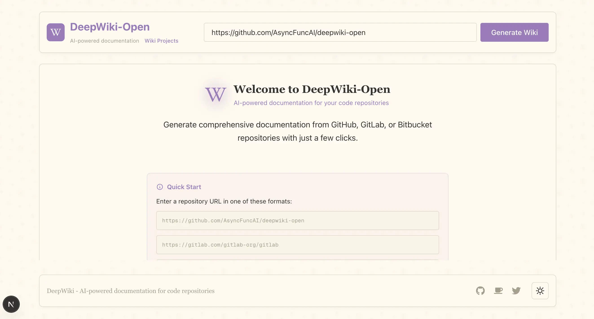
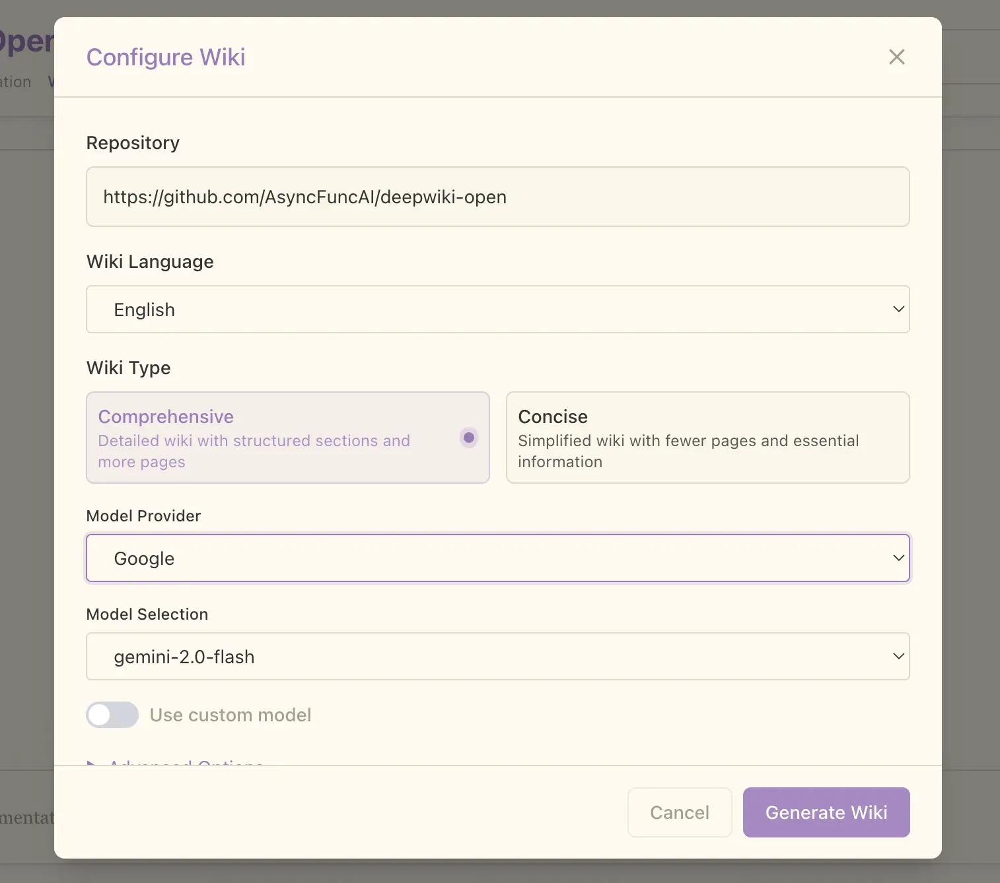
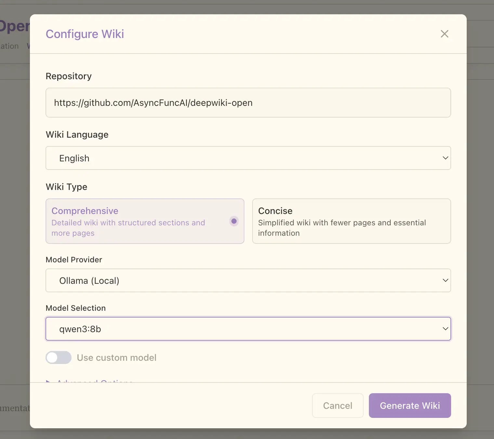
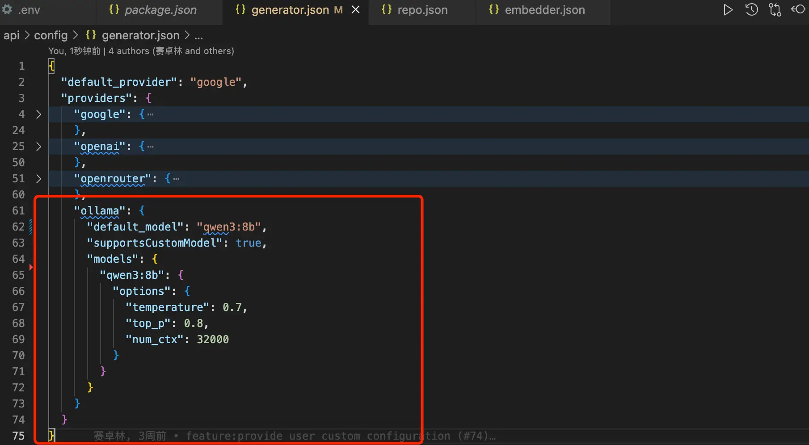
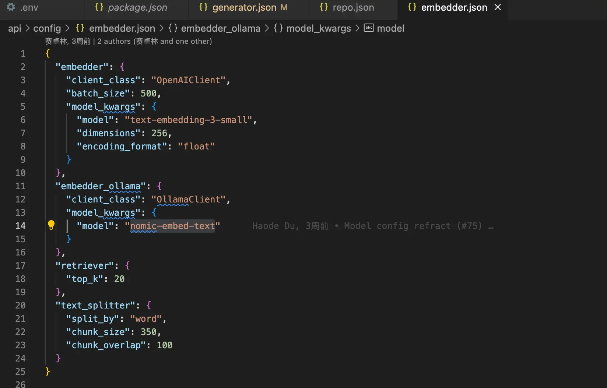
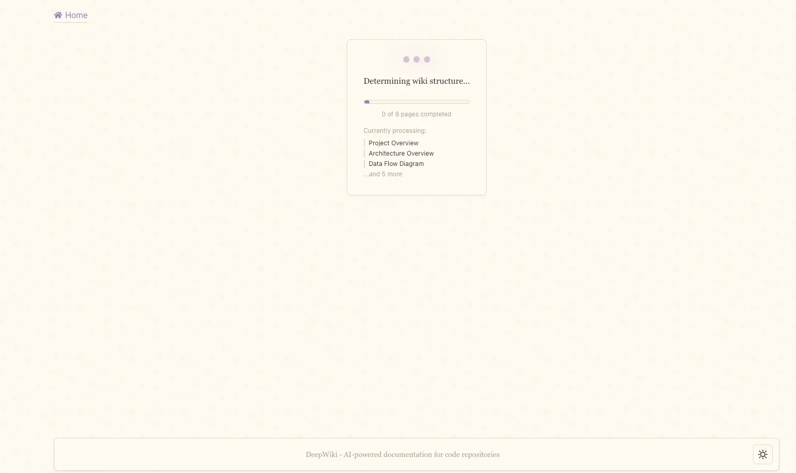
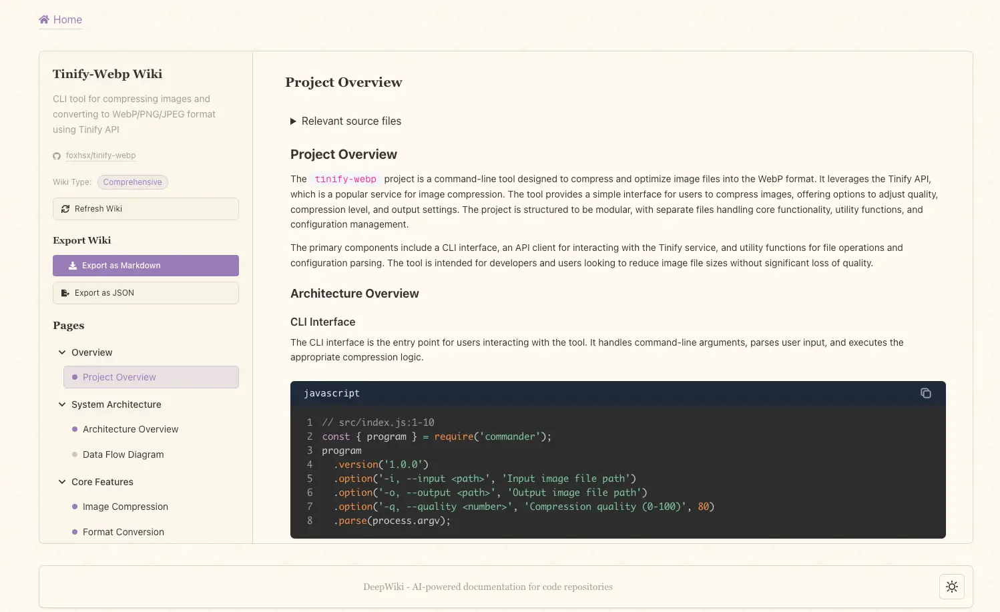
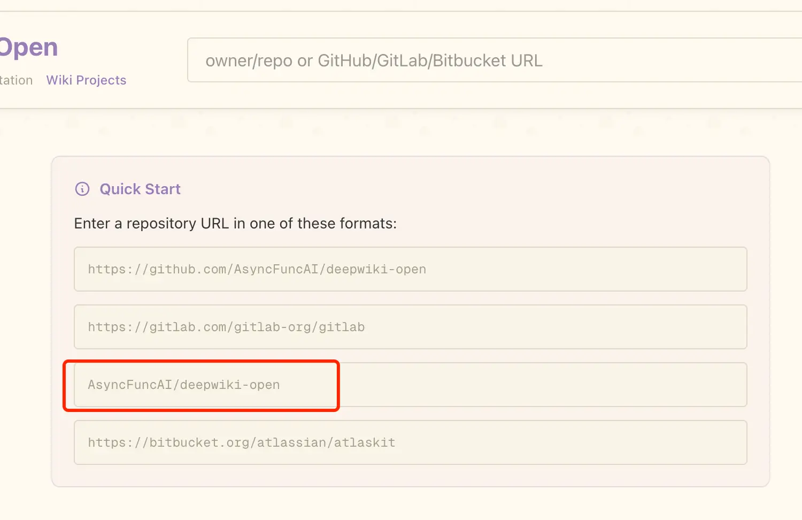
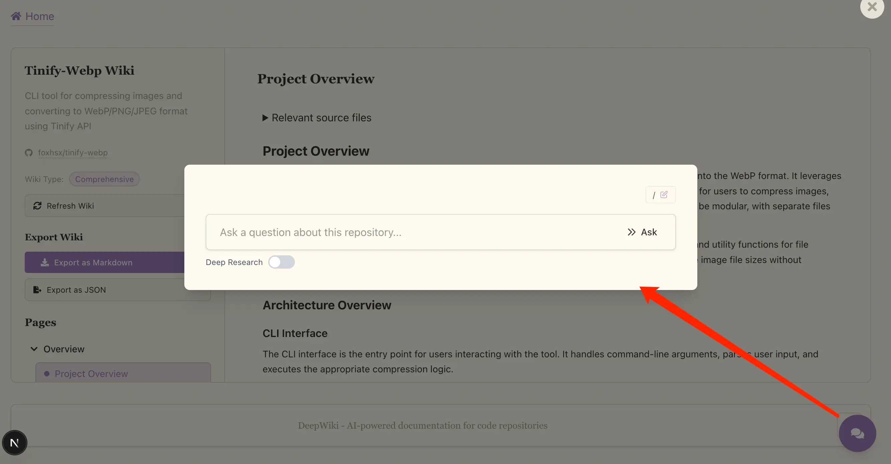

朋友们！经历了一个月搬家以及冲刺老板们定的 KPI 之后，我三金又回来了～

这次紧接着上次讲的 DeepWiki，给大家介绍它的开源版——DeepWiki-Open。

有了开源版本之后，我们就可以在本地部署一个 DeepWiki 应用，这可以有效地进行私有项目解读并为其生成项目文档。

那为什么有了 DeepWiki 之后我们还要介绍 DeepWiki-open 呢？两个点：

1. 一般来说，需要使用开源版 DeepWiki 的，代码是无法对外公开的，比如公司内部项目。
2. 要使用 Cognition AI 推出的 DeepWiki 生成私有项目文档，还需要付费。也就是说你的代码不仅要让人家看，还得付费人家才看。

所以开源版和官方版的差别就出来了：

* 要学习公开项目，直接上 DeepWiki；
* 要学习私有项目，可以选择 DeepWiki-Open。

让我们切到实际工作中来，DeepWiki-Open 项目能带给我们什么？

* 不用人为地输出项目文档，DeepWiki-Open 可以快速为我们生成前后端项目文档；
* 不用费时费力查找陈旧的 API 接口，远古的前端组件，通过文档菜单一路了然；
* 不用担心数据泄漏，本地部署 + 本地大模型保护数据安全；
* 对新人而言，快速了解项目架构，加速熟悉项目进度等等。

那如何进行部署呢？这里提供了两种方式：

* 使用 docker；
* 源码启动

本来我是想通过 docker 一键部署的，但是它要本地构建镜像（是的，它没 remote 镜像），我尝试构建了一次但由于网络原因失败了，所以干脆直接源码启动！

这里可以分为三步走：

* 创建环境变量文件 `.env`，里面可以设置 Google Gemini、OpenAI、OpenRouter 和本地 Ollama 模型；

```
GOOGLE_API_KEY=your_google_api_key
OPENAI_API_KEY=your_openai_api_key

# 可选：如果您想使用OpenRouter模型，添加此项
OPENROUTER_API_KEY=your_openrouter_api_key

# 可选：用于自定义 OpenAI API 端点
OPENAI_BASE_URL=https://自定义API端点.com/v1
```

这里要注意一点，如果不使用 Ollama，那么需要配置 OpenAI API 密钥用于 embeddings。也就是说 OpenAI 的 API 在不使用 Ollama 本地模型的情况下，必须得配置！

这点比较坑，我在没有配置它的情况下使用 OpenRouter 解析了好多次项目都没成功，后面还是在看中文文档的时候发现这点的。

但配置上 OpenAI 吧，说实话 token 跑得有点快，吓得我赶紧停止分析。

最终只能选择 Ollama：对话模型使用 qwen3:8b，嵌入模型使用 nomic-embed-text。

* 接下来我们启动后端，为了不让 python 依赖版本在本机出现冲突，可以使用 venv 创建一个虚拟环境，在这个环境中安装依赖并启动项目；

```bash
# 创建虚拟环境
python3 -m venv deepwiki-open

# 激活虚拟环境
source ./deepwiki-open/bin/active

# 安装后端项目依赖
pip install -r api/requirements.txt

# 启动 API 服务
python -m api.main
```

* 最后启动前端项目，这个就直接在项目根目录下安装依赖并启动即可。

```bash
# 安装前端依赖
yarn install

# 启动前端项目
yarn dev
```

打开浏览器访问 localhost:3000，就可以看到 DeepWiki-Open 的界面了～



页面顶部是输入项目地址的地方，输入后我们点击「Generate Wiki」可以看到配置界面：



在 Model Provider 选项上我们可以更换模型，这里选择 Ollama：



在模型选择上，DeepWiki-Open 并不会自动读取我们本地部署了哪些大模型，而是要到 `generator.json` 文件中手动进行设置：



同理，嵌入模型设置也是一样，如上图所示的 `embedder.json` 就是嵌入模型的配置文件：



回到 DeepWiki-Open 的配置界面上，当我们选择好模型之后就可以点击右下角的「Generate Wiki」按钮开始进行项目解析了，这个过程会根据项目大小和模型强弱来决定最终的生成时间：






除了支持自建的私有 Git 仓库之外，DeepWiki-Open 还支持本地目录访问，只需要在地址栏输入代码所在的目录路径即可。类似下图红框那种路径：



生成的文档也支持对话和 Deep Research：



感兴趣的小伙伴们可以试起来了～Github 地址：https://github.com/AsyncFuncAI/deepwiki-open
