小伙伴们大家好，我是三金～

最近降温降得厉害，大家要注意保暖啊。

这周比较忙，年底的 KPI 冲起来真的废人，晚上下班已经很晚了。但是又想下班之后再搞搞 RAGFlow，所以浅熬了一下夜，中间是经历了一些坎坷，不过幸好最终 RAGFlow 还是顺利跑起来了。

老粉应该都知道，三金之前大多数时间都在看 Dify，那为什么这周突然想试试 RAGFlow 呢？

主要原因还是 RAGFlow 强大的 AI 知识库能力。Dify 虽然称得上是开源版的 Coze，但是它的知识库能力一直比较拉垮，在这一点上 FastGPT 也是强于它的。

> FastGPT 和 Dify 的对比，可以看我之前的文章[AI 知识库对比：Dify 还是 FastGPT](https://mp.weixin.qq.com/s?__biz=MzUyODkwNTg3MA==\&mid=2247485319\&idx=1\&sn=a16827942700d6bce469c815a933ea0c\&chksm=fa686466cd1fed706a2710a505f13b261a352d340fd503f1b6643a48d85e2f28a39b577ad6d4\&token=207454168\&lang=zh_CN#rd)。

既然说 AI 知识库是它的强项，那具体强大在哪里？以及如何部署或者说如何体验呢？别着急，我们一起往下看～

#### 部署

##### 最低配置

部署 RAGFlow 有一个硬性条件，机器配置不能太低。官网推荐最低配置需要满足：

* `CPU ≥ 4 cores`;
* `RAM ≥ 16 GB`;
* `Disk ≥ 50 GB`;
* `Docker ≥ 24.0.0 & Docker Compose ≥ v2.26.1`.

这个配置要求真的不低了，要知道部署 Dify 的推荐要求是 2 核 4G，而部署 FastGPT 生产首选版本的最低要求是 2 核 8 G，RAGFlow 直接翻倍。

> 为什么会需要这么大配置？
> 首先，它的镜像就很大，0.13.0 版本的镜像已经大到了 19.53 GB；
> 其次，RAGFlow 是一个基于深度文档理解的开源 RAG（检索增强生成）引擎。为了实现对文档的深入分析和处理，其模型需要大量的计算资源和存储空间，以确保能够高效地执行复杂的查询和生成任务。

##### 调整内核参数

满足以上配置之后，在部署之前我们还需要检查一下机器的 `vm.max_map_count` 也就是内核参数。一般默认是 65530，但是为了满足 Elasticsearch 进行多次召回，我们需要将其设置为 `大于等于 262144`。这一步至关重要！！

> `max_map_count` 内核参数定义了一个进程可以拥有的最大虚拟内存区域。
> 它主要影响高并发或者高资源需求的应用程序的性能和稳定性，比如 Elasticsearch、Redis、数据库系统等。刚好，这三样 RAGFlow 它都有。

对于 Linux 系统来说，我们可以通过输入以下命令来查看 `max_map_count` 的大小：

```shellscript
sysctl vm.max_map_count
```

如果小于 262144，那么需要执行以下命令将 `max_map_count` 重置为至少 262144 的值：

```shellscript
sudo sysctl -w vm.max_map_count=262144
```

> 注意：这个设置会在系统重启后重置。如果要永久修改这个值，需要在 `/etc/sysctl.conf` 中进行修改或者添加。

##### clone 项目仓库

```shellscript
git clone https://github.com/infiniflow/ragflow.git
```

##### Docker 启动

jio do ma dai～

启动之前大家伙也要注意一下镜像版本，对于 dev-slim 的镜像版本来说，因为镜像中不包含 embedding 模型和 Python 库，所以大小是 1GB 左右。但是如果是类似我上面说的 v0.13.0 版本，它的大小足足有 19.53GB。

大家可以根据需要在 `docker/.env` 配置文件中修改镜像版本，比如：`RAGFLOW_IMAGE=infiniflow/ragflow:v0.13.0-slim`。

```shellscript
cd ragflow/docker

docker compose -f docker-compose.yml up -d
```

如果大家因为网络原因无法正常拉取镜像和模型，可以在 `docker/.env` 文件中根据注释修改 `RAGFLOW_IMAGE` 和`HF_ENDPOINT`。

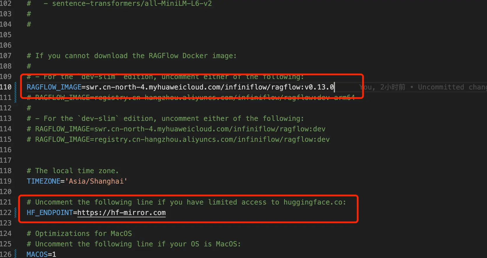

那如何查看项目是否已经部署好了呢？我们可以执行以下命令：

```shellscript
docker logs -f ragflow-server
```

如果出现以下信息说明系统已经成功启动了！～

```shellscript
     ____   ___    ______ ______ __
    / __ \ /   |  / ____// ____// /____  _      __
   / /_/ // /| | / / __ / /_   / // __ | | /| / /
  / _, _// ___ |/ /_/ // __/  / // /_/ /| |/ |/ /
 /_/ |_|/_/  |_|____//_/    /_/ ____/ |__/|__/

 * Running on all addresses (0.0.0.0)
 * Running on http://127.0.0.1:9380
 * Running on http://x.x.x.x:9380
 INFO:werkzeug:Press CTRL+C to quit∅
```


#### 使用

因为 RAGFlow 启动之后，默认的对外端口是 80，所以我们可以直接通过 IP 地址即可进行访问:


这里需要先注册一下，然后再登录：


OK，到现在为止我们已经成功登录部署好的 RAGFlow 了。

接下来还需要再在设置页面设置一下 AI 大模型，因为是主打知识库的系统，所以除了一般的 AI 聊天模型之外，我们还需要 embedding 模型（有 Rerank 模型更好！！）。

##### 配置模型

以 `Qwen/Qwen2.5-7B-Instruct` 和 Jina 的嵌入模型为例。

设置步骤：

1. 点击右上角的头像
2. 选择左侧菜单中的「模型提供商」
3. 在「待添加的模型」中选择要使用的模型供应商
4. 配置好供应商的 API key 之后，点击右上角的「系统模型设置」
5. 在弹出的对话框中选择要设置的模型，点击保存即可。

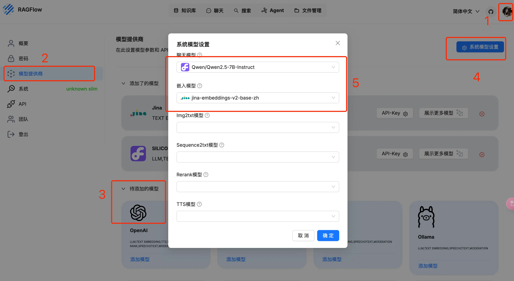

##### 创建知识库

回到知识库页面，点击右上角的「创建知识库」创建一个新的知识库，比如 k8s：


点击确定之后进入知识库的配置页面：


这里可以配置语言，默认是英文，我们可以将其改为中文。在下方配置中还有「解析方法」的选项，种类繁多，感兴趣的小伙伴下来可以自行研究，这里只做 demo 展示，我们就使用默认的 General。

回到数据集这里，我们需要为这个知识库增加数据来源，上传一个老演员《深入浅出 k8s》，然后点击表格内的绿色播放按钮开始解析文件：

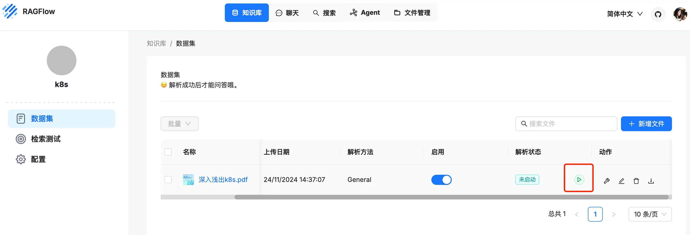

解析过程需要一定的时间，大家耐心等待即可。

解析成功之后我们到「聊天」页面，如果不进行任何设置，是无法新增聊天的。所以我们需要先「新建助手」：

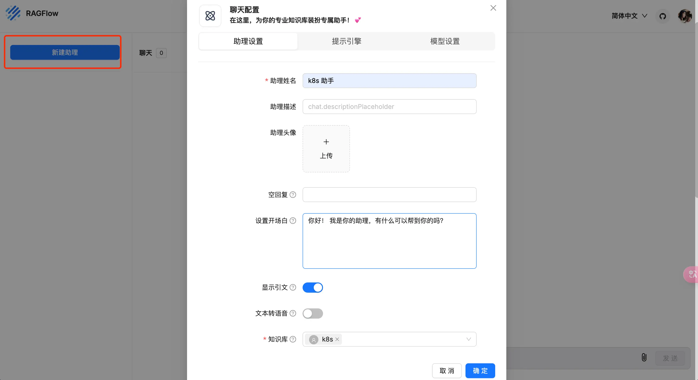

接下来点击聊天旁边的「+」号新增一条聊天：


我们简单的来提问一下：


回答是没有问题的，不过也感觉没有什么亮点。但你仔细看：


* 鼠标 hover 到答案时，会展示几个图标，我们点击最右侧的灯泡图标会发现它将答案中涉及到的内容都统一到了这里；

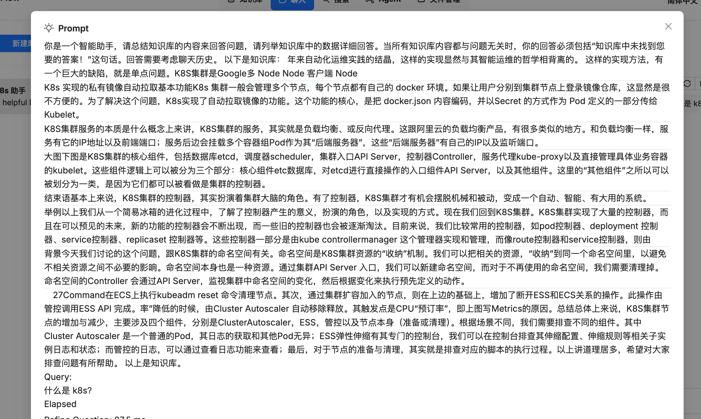

* hover 答案中的小图标时，会将这段内容的来源展示出来

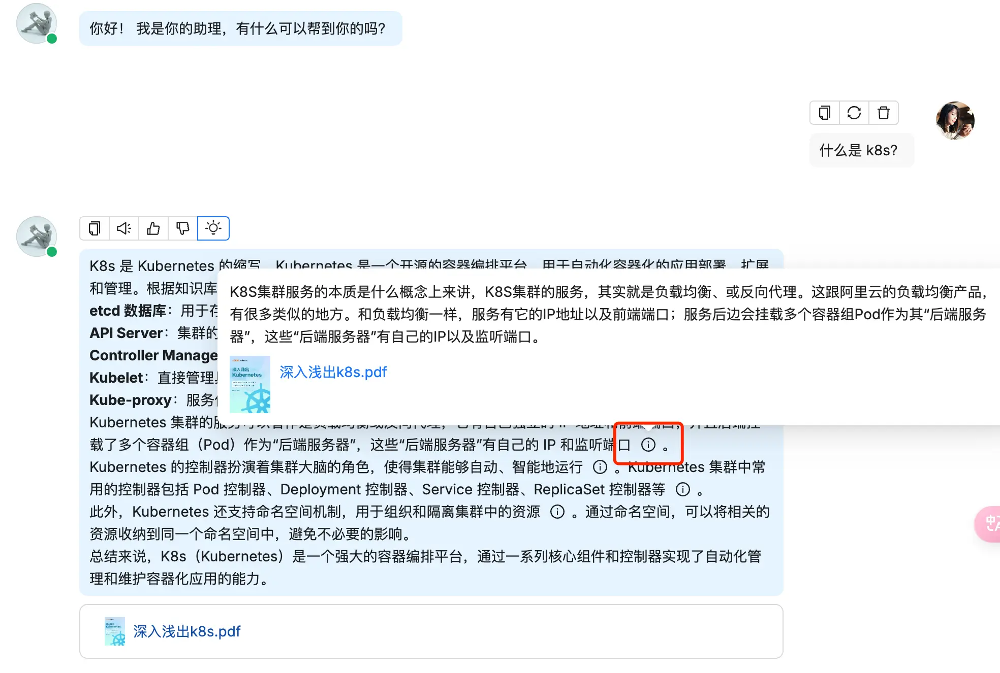


* 如果回答的内容过长，还可以通过「继续」的方式来实现长文本输出；
* 同时回答的下方也会给出答案是出自哪些文件。

##### 测试其他功能

除了知识库之外，还有搜索、Agent 和文件管理。其中搜索是可以直接搜索知识库中内容，类似这样：


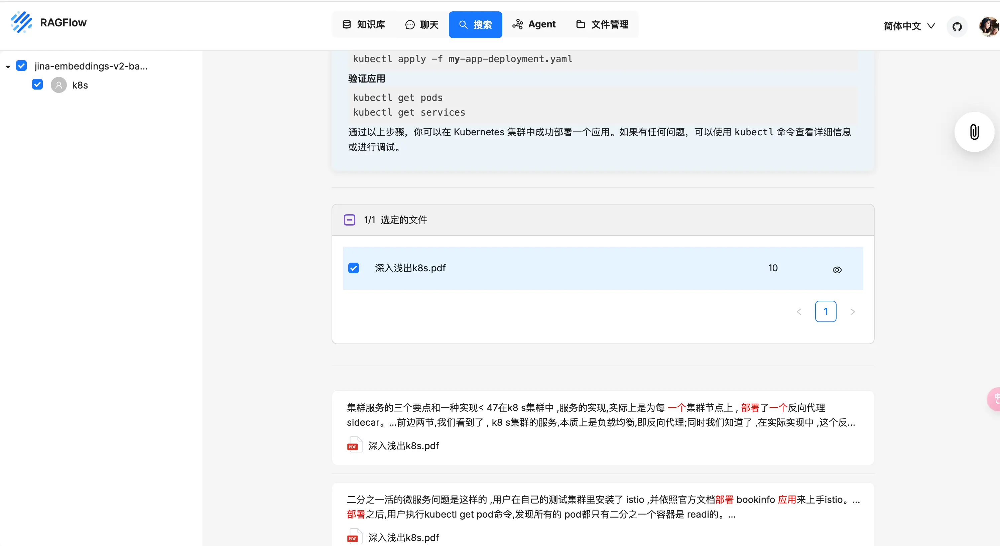


还有 Agent，在 RAGFlow 中除了第一个「Blank」是可以自定义 Agent 的之外，其他几个都是内置的 Agent 模板：

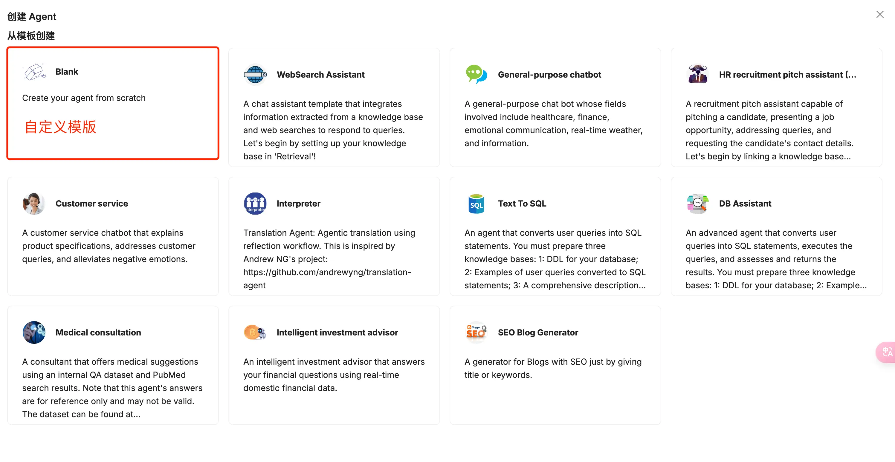

对于文件管理来说，顾名思义，这里可以对已经上传的文件进行管理。

#### 对比

* 从 Agent 的功能上来说，RAGFlow 的 Agent 能力是弱于 Dify 的，而且 RAGFlow 的 Agent 实际上是 Workflow；
* 在知识库数据集的来源上，Dify 还支持 Notion 和 Web 站点，但 RAGFlow 目前只支持本地上传；
* 但话说回来，在知识库检索以及回答这块，RAGFlow 明显强于 Dify；

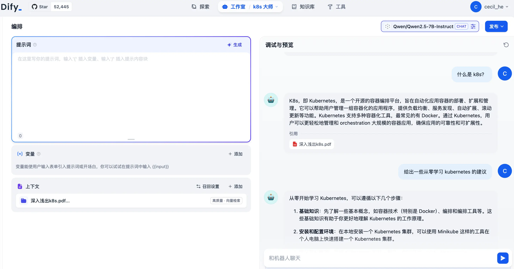

* RAGFlow 的搜索功能可以输出长文本，Dify 目前还不行；
* RAGFlow 的回答如果没有输出结束，还能继续回答；

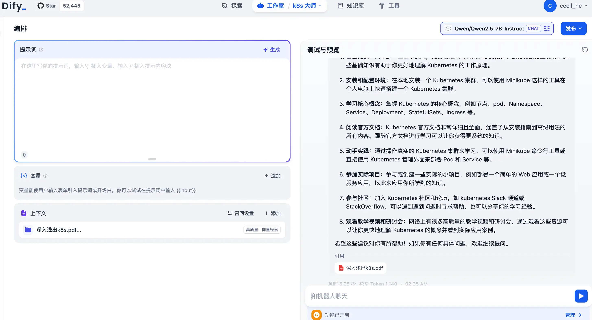

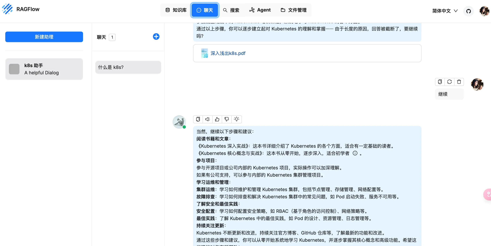

* RAGFlow 没有提供单开对话页面的功能，只提供了 API 的能力；而 Dify 不但能单开页面和支持 API，还能直接嵌入到外部的 Web 站点；

总得来说，如果是企业内部需要一个比较牛的 AI 知识库系统，推荐使用 RAGFlow；对于个人用户的话，如果对知识库能力的要求不那么高，Dify 完全是够用的。毕竟 RAGFlow 的配置太高于 Dify 的，如果是想搭建比较私密的 AI 知识库，那么还需要部署本地 AI，此时哪怕是 4 核 16G 都有些不够用了。

OK，今天的分享就到这里了，大家周末愉快～

> [GIthub 地址
> ](https://github.com/infiniflow/ragflow/blob/main/README_zh.md)[官方文档](https://ragflow.io/docs/dev/)
