> 这篇文章，我想了很久，还是决定写一下。
> screen-to-code 对于开发者来说可能有些鸡肋，但是对于一些非技术人员来说，够用且轻量，配置合适的 AI 之后网页的还原度也高。

### 生成网页的方式

相信大家对 Vercel 家的 v0 都有所耳闻，不少小伙伴们还都下场使用过，它被定义为“人人皆可用的应用构建器”。通过自然语言的方式使其生成 React + Tailwind CSS 代码，具有实时预览和迭代功能。

但它并非没有缺陷：

* **网络问题**。由于 Vercel 本身是国外网站，所以作为他们家的 v0，也是如此。国内访问比较不稳定。
* **强绑定 React 生态**。想使用其他技术栈需要通过 prompt 的方式，具有一定的局限性。
* 对于非技术人员来说，由于其生成的代码遵守 React 组件化的设定，反倒增加了学习曲线。
* **无法完全私有化**。

要解决以上问题，其实有几种方式：

* **使用 AI CLI + 代理的方式**。比如使用 Claude Code、Codex 或者 Gemini CLI；
* **使用 Web 应用**，比如 GLM-4.5-Flash；
* 使用开源工具 **ScreenToCode**。

### 以非技术人员的视角看

**第一种方式是目前深受开发者所喜欢的**，尤其是在搭配 Skills 之后，对于生成页面这种事情更是如虎添翼、信手拈来。

但是相对应的，这种方式也存在一定的局限性：

* 对于非开发人员来说，这个方式存在一定的学习成本。
* 终端方式并不适合每个人，比如设计师和产品经理，他们可能更倾向于可视化的工具。

其中**第二种方式最简单**，因为：

1. 你只需要访问他们的网址；
2. 上传图片或者复制粘贴要制作的网页地址；
3. 告诉 AI 你想做一个一模一样的网页

回车之后它就会为你快速输出一个网页代码出来。比如我上传了一张博客的图片，并让其生成对应的代码：

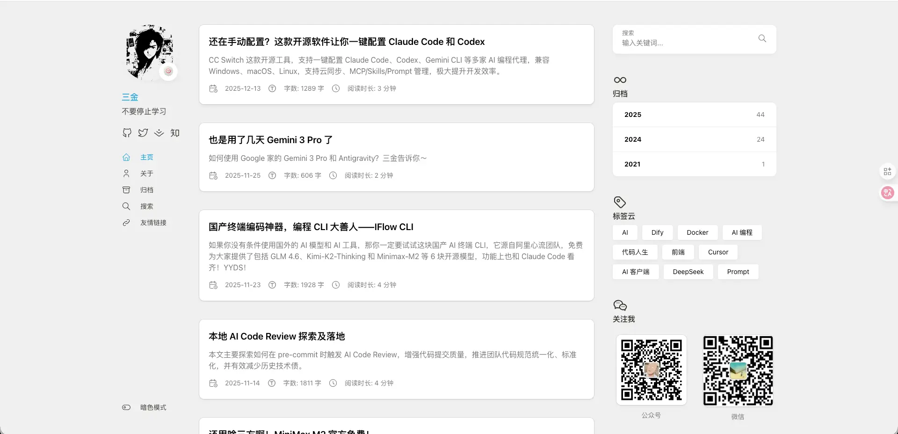

然后它开始解析图片并逐步输出代码到对话框中：

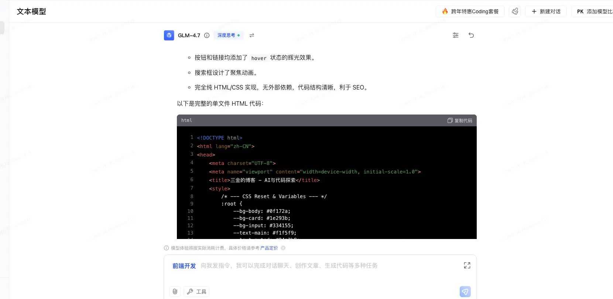

我们把对应的代码粘贴复制到一个 html 文件中并双击打开：

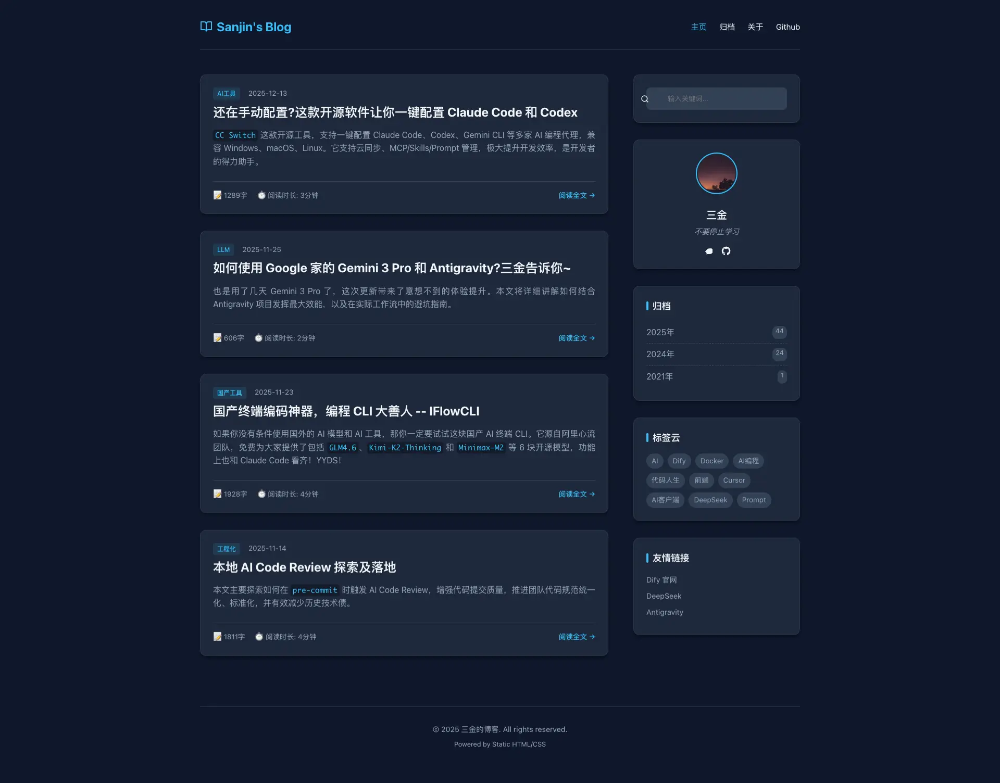

可以看到它确实生成了一个博客网页，但是**差别还是有些大的**。主题、布局、排版和原图都差距较大，像是在原图的基础上又按照自己的理解设计了一个新的出来，只适用于不太在乎还原度的玩家。

最后——**screen-to-code**，在体验之后发现，**它的操作便捷性以及还原度竟然秒杀前两个**！

首先，在便捷性上：

* **只需要提供截图或者网页链接即可快速进行 AI 还原**；
* screen-to-code 会**提供四个 Option，用户可以在其中对比找出一个还原度最高的**；
* 还可以**选中其中的某个 Option 进行对话式修改**。

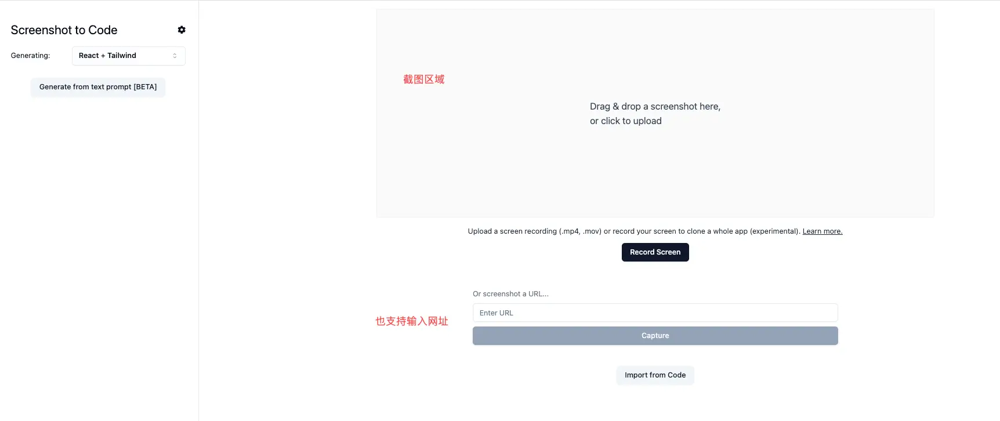

其次，在还原度上我们以上面的截图为例，我们看看 screen-to-code 的实际效果：

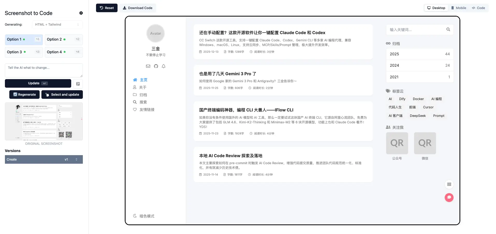


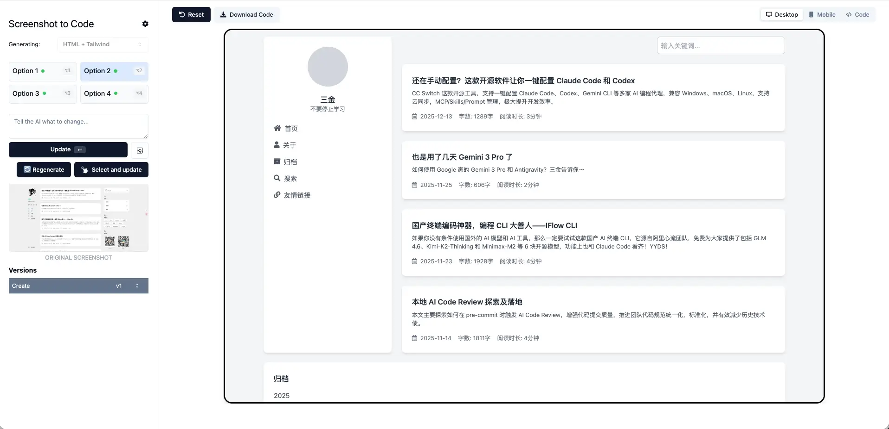

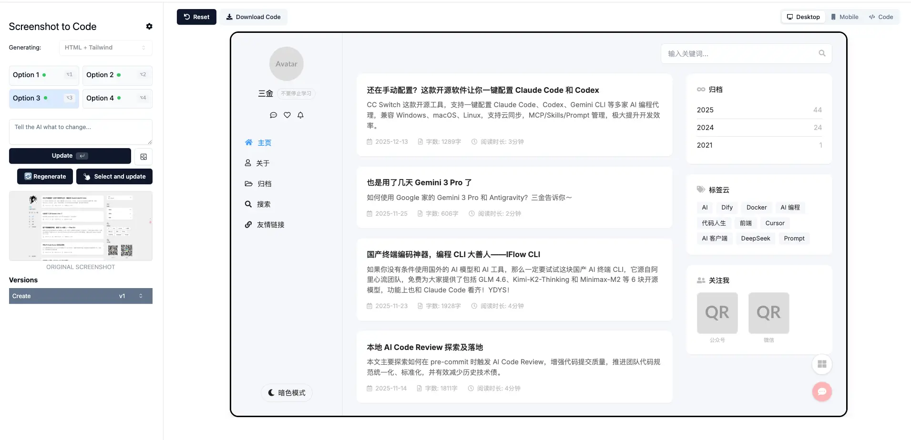

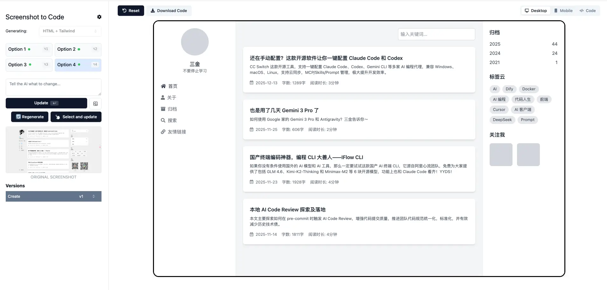

除了第二张之外，其他三张的还原度都挺高！尤其是 1 和 3，个人觉得可以直接拿来使用了。

另外，它还提供了七种生成方式，如下图所示：

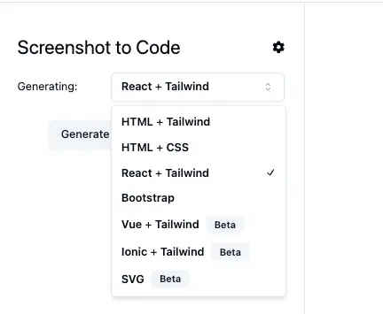

**对于非技术人员来说（尤其是想做个官网、个人主页之类的小伙伴），HTML + Tailwind、HTML + CSS 以及 Bootstrap 这三种方式简直是为你们量身定做！**

找个喜欢的页面截图或者链接贴进去，不一会儿就给你生成好页面框架，你只需要下载文件后修改里面的内容和图片就可以直接使用了。

而剩下的几种方式，个人觉得**比较适合大学生的期末作业**。像 React + Tailwind 或者 Vue + Tailwind 这种，也不用啥工程化的东西，快速产出，完全不用为写页面而发愁。

### 部署

说了这么多具体怎么使用呢？

两种方式：

* 访问官网：https://screenshottocode.com/。不过得花钱，两个档位：\$15 和 \$40。
* 自己部署或者访问其他大佬部署好的。

自己部署的话，推荐使用 docker 一键部署：

```shellscript
git clone https://github.com/abi/screenshot-to-code.git

cd screen-to-code

# 非常重要！！
echo "OPENAI_API_KEY=sk-your-key" > .env
echo "OPENAI_BASE_URL=your-custom-url" > .env

docker compose up -d --build
```

成功后，访问 `http://localhost:5173` 即可。

最后补充三点：

* AI 模型需要多模态模型，比如 GPT-4o、或者 llava；
* API Key 和 Base URL 可以在设置中进行配置；
* 要使用 URL 的方式，需要配置 ScreenshotOne API key，每月会免费提供 100 次的使用额度。个人开发完全够用

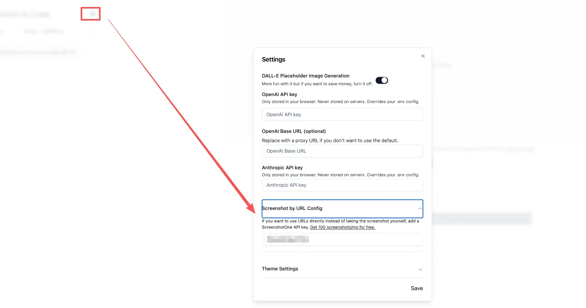

附，测试生成的代码：

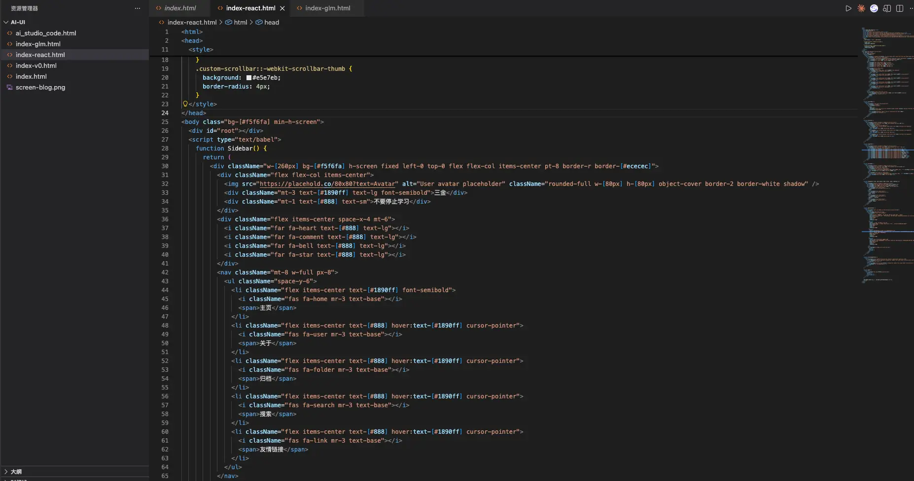

