Hi\~大家好，我是三金。

相信只要是玩儿过 skill 的人都听过或者用过 Anthropics 官方的一个 skill —— skill-creator。

它是一个可以帮我&#x4EEC;**“做 skill 的 skill”**（听起来有点绕口😂），简单点说：我们直接了当地告诉它需要什么能力，它就会引导我们一步步把这个能力输出成一个结构完整、能真实触发、测试以及迭代的 skill 技能包。

可以说它就是 Claude 生态或者 skill 生态中的**技能工厂**。


在正式介绍这个 skill 之前，让我们来回顾一下 skill 解决了什么问题。想象一下这种场景：

> 你在使用 AI Coding 进行项目开发，在开发过程中发现有很多重复的工作，比如每次写完代码都需要按照固定流程做一次 Code Review：需要检查安全、检查性能、检查命名规范等。
> 每当这个时候你就像一位推销人员，将你的固定话术重复输出给 AI：在 CR 时你要注意这几点或者注意那几点。

于是你就在想：要不直接把这套流程打包成一个工作流，以后直接跑这个工作流不就可以了？

这就是 Skill —— 把重复的工作流打包成可复用的指令集。

但光知道 Skill 也不行，还存在以下问题：

* SKILL.md 应该怎么写？
* 如何定义 description 才能让技能在该触发时触发，不该触发时别触发？
* 写完要如何验证它真的管用？
* 人工输出 SKill 会耗费非常大的精力，需要你自己想提示词、想触发条件以及限制条件，需要自己进行多轮测试。一个好的 skill 往往会耗费你几周甚至几个月的时间，如何提高效率？

skill-creator 就是来解决这些问题的，它会引导我们走完从“有想法”到“能落地”的全流程。

#### 安装

在终端输入以下指令进行 skill-creator 安装：

```bash
npx skills add anthropics/skills --skill skill-creator
```

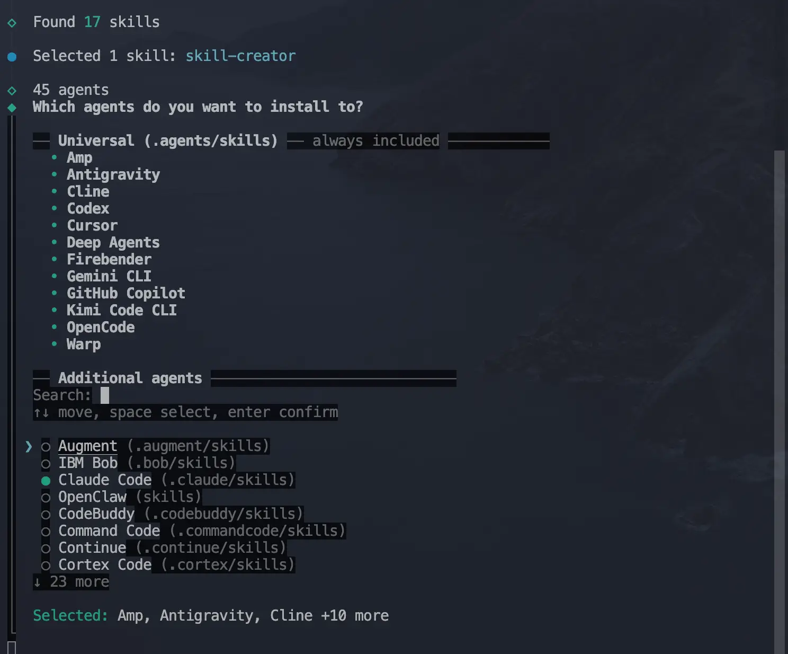

以 Claude Code 为例，空格选中之后回车。接下来选择项目级别的安装还是全局安装：

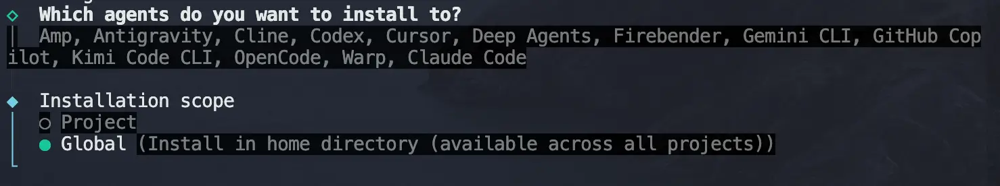

继续回车即可。安装好之后打开 Claude Code，输入 `/skill-creator` 即可看到：

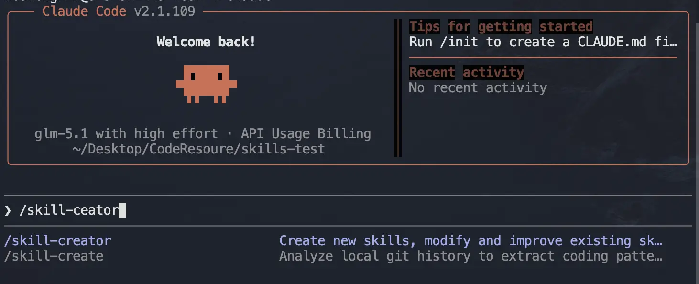

#### 使用

使用起来也非常简单，我们在 Claude Code 中直接了当地告诉它：

```shellscript
使用 skill-creator 帮我实现一个[实际需求]
```

再具体一下，以我们提到的 CR 为例：

```shellscript
使用 skill-creator 帮我实现一个 code-review。

目标，检测代码中：
- 明显的语法问题、边界问题、异常处理、竞态问题等
- 业务逻辑耦合，可读性和可维护性差！
- 不符合项目规范，代码风格差异大；
- 潜在的逻辑漏洞或者其他 bug；

输出问题点，并指出原因和修复建议。
```

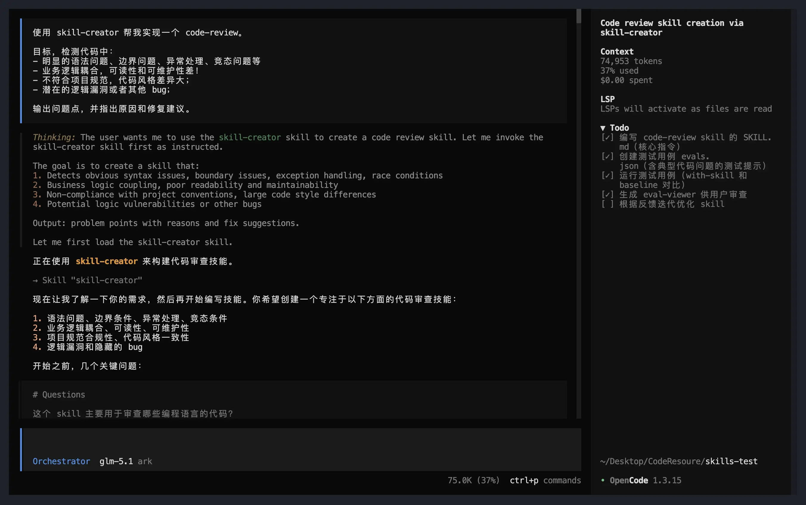

接下来 skill-creator 会：

* 追问一些边界情况

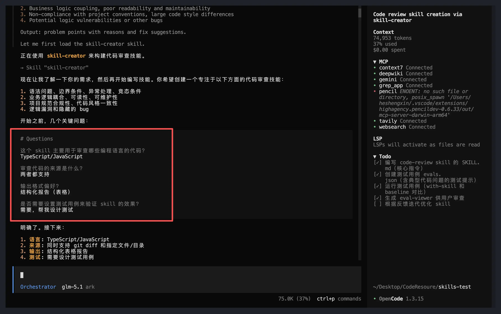

* 帮你生成 `SKILL.md`

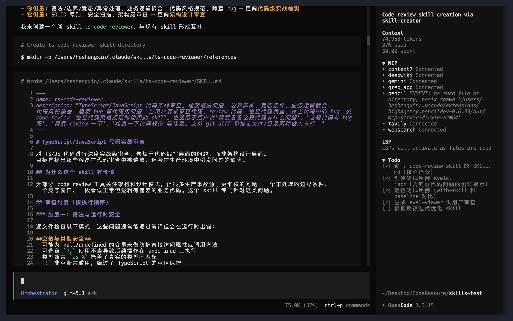

* 给你 2-3 个测试 prompt

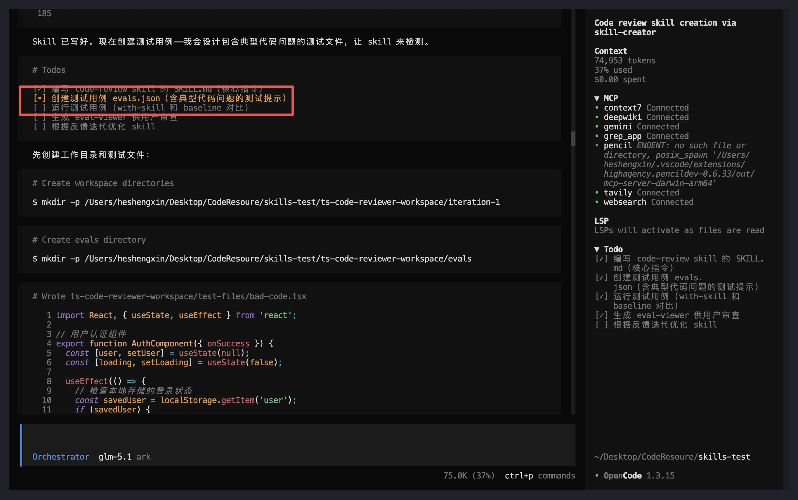

* 你跑完看效果，觉得不行就让它改

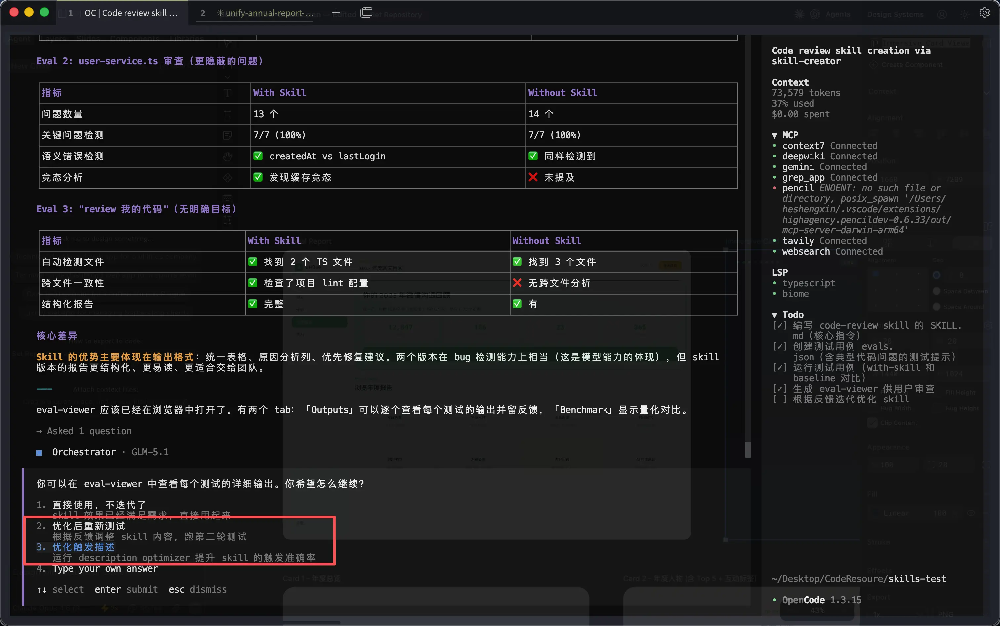

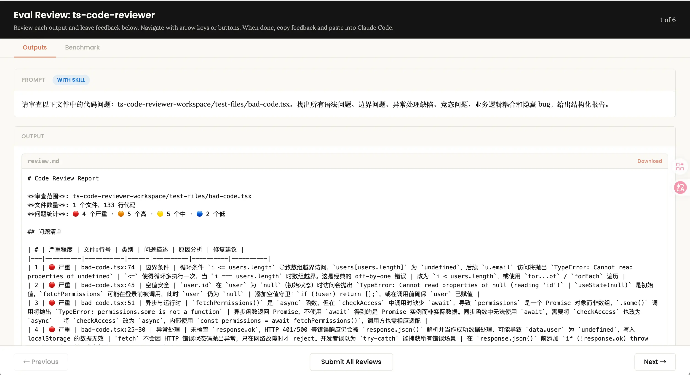

整套创建流程异常丝滑，生成的 skill 在实际测试中也表现出色，可以清晰地指出代码中的缺陷，并按照优先级进行排列：

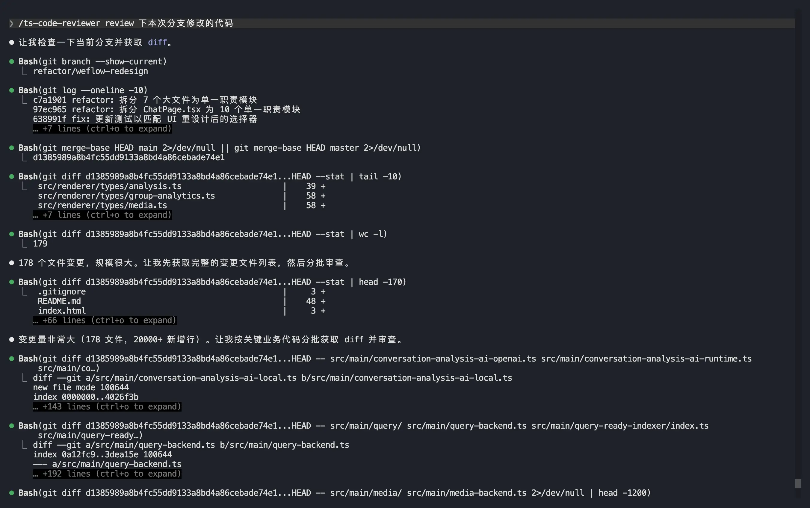

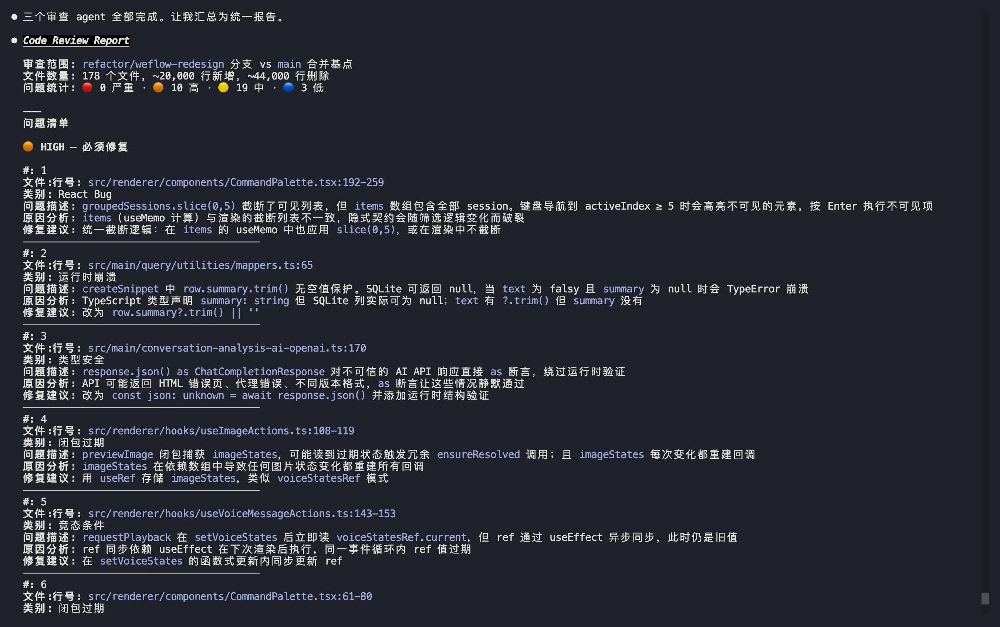

#### 怎么工作的

根据上一小节的演示，其实大家也能大概看到 skill-creator 的创建过程分为五步：

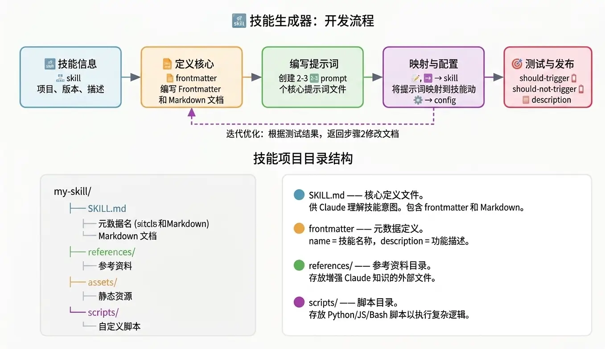

**第一步：告诉“我”你的梦想是什么（bushi）**。你需要告诉 skill-creator：我想做一个 Code Review 的 Skill。然后它就会反向追问你几个问题（如上一小节所示的截图），逐渐**把模糊想法梳理成清晰的需求**。

**第二步：它帮我们写 Skill.md**。根据上一步得到的结论，它会自动生成 frontmatter（也就是 name、description 等）和 Markdown 正文指令。当然如果你需要 `references` 以及 `scripts` 等附加目录，它也会帮我们规划好。

**第三步：它生成测试 prompt（在 eval.json 中可以看到）**。从这一步开始就是重点，skill-creator 并不是把 Skill 写完就完事儿了，它会帮我们生成几个真实的测试场景去跑，然后再由我们来验证一下生成的这个 Skill 是否真的管用。在 AI + 人工协作时代，我始终认为**人工审查验证是必不可少的护城河**！

**第四步：迭代**。衔接上一步，**根据验证结果 -> 反馈 -> 优化 skill -> 再测试验证**。多轮迭代下来，Skill 的功能会越来越趋近于我们的目标，直到完全吻合。

**第五步：优化触发**。这是非常关键的一步。它会帮我们构造**应该触发**和**不应该触发**的指令集，然后反复调整 frontmatter 里的 description，让你的 Claude **既不会乱触发，也不会漏触发**。

OK，到这里我们就已经基本认识了 skill-creator，并可以使用它生成想要的 skill 了。还在使用传统手艺进行 skill 开发的小伙伴可以切到这个工具上试试。