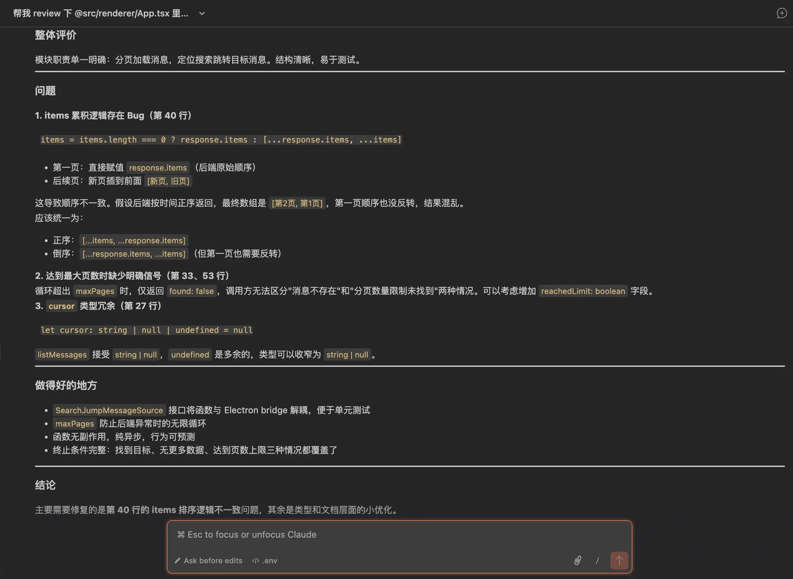
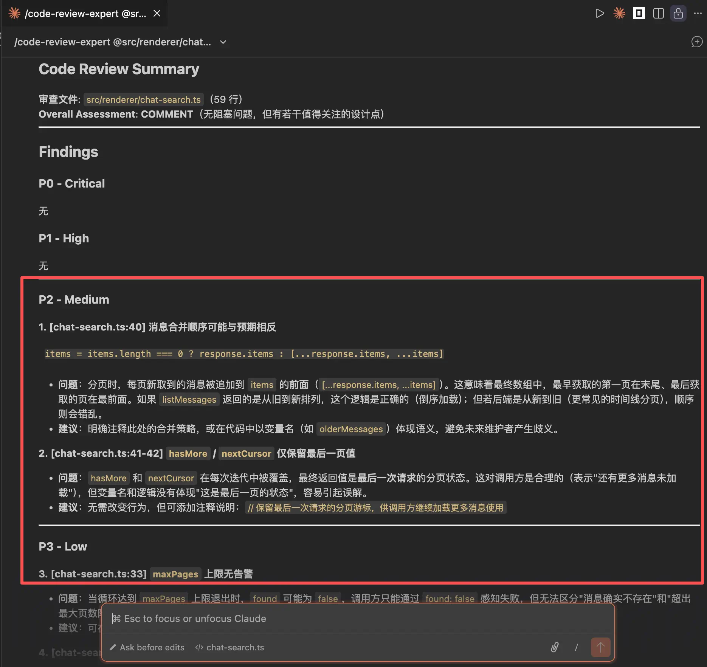
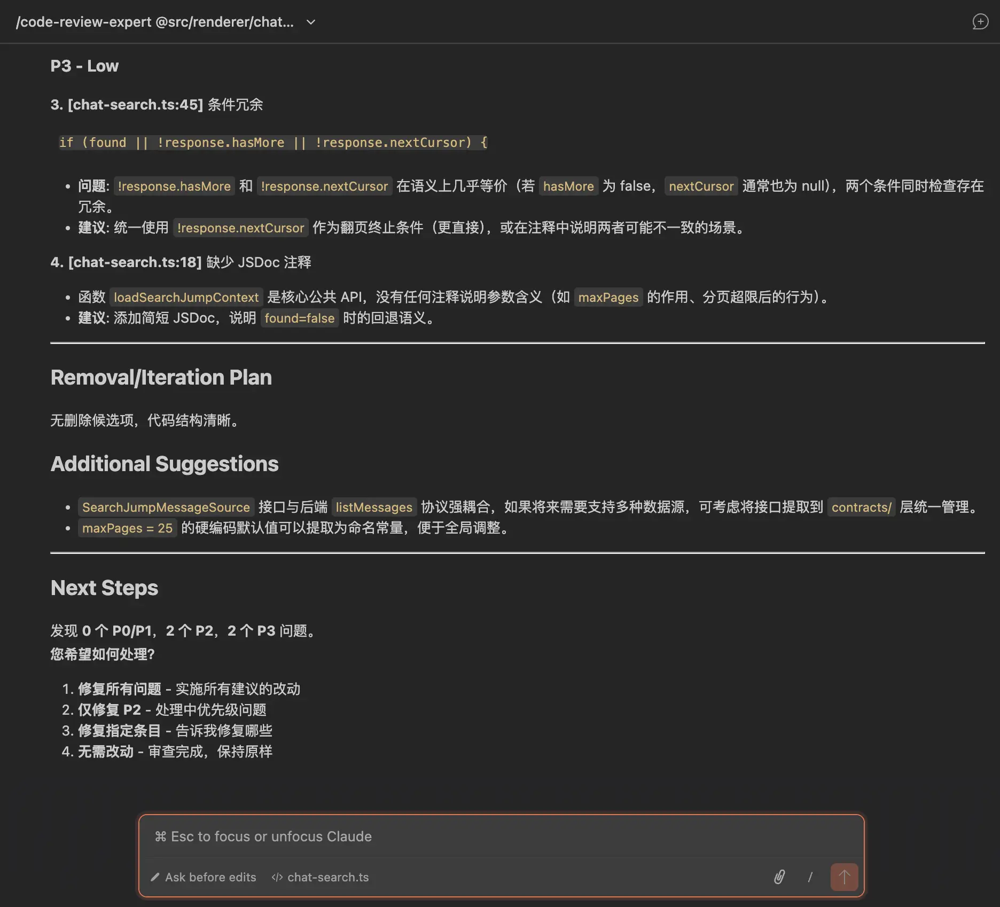

Hi，大家好，我是三金～

最近有小伙伴问我，skills 怎么感觉和 prompt 一样？为啥又搞一个概念出来？

其实我和他一样，在第一次看到 skills 这个东西时，也以为它就是个进阶版的 prompt：能反复使用，减少上下文损耗。

但深入研究了一下发现，还是兔羊兔森破了。在很多场景里，大家想复用的根本就不是一句话要怎么写，而是一整套的做事方法。比如：

* 代码审查怎么审？
* 文档改写按什么口径改？
* 发布前要不要核对清单？
* 碰到某类任务需要先看哪些资料？
* 以及最终的交付产物应该是怎样的等等

这些才是更难稳定的部分，也是大家最想复用的重点！

### Skills 解决了什么问题？

在 skills 出现之前，我们通常使用自定义 command、自定义 Agent 来解决一些重复工作，但实际效果可能并不能如我们所愿的那样好。

造成这种结果的原因通常来说不是单点的。

有时候是描述没补全，有时候是输出格式跑偏；还有时候是模型只知道大方向，但漏掉了一个团队约定、一个检查步骤，或者一份本来需要参考的本地资料。

只靠聊天现场去补充这些东西，往往费力不讨好。Skill 要做的事情，恰好就是把这些会反复出现的指引、资料、约束提前给装到一个包里，让它每次开工都从更接近正确的位置起跑。

对于个人开发者或者独立开发者来收，最直接的收益就是少解释。A 社也明确提到过几类典型受众：

* 想让 Claude 稳定遵循特定工作流的开发者
* 会自动化重复任务的高级用户
* 希望统一 Claude 行为方式的团队。
* 以及想把集成能力和稳定流程放在一起用的 MCP connector builders

落到团队&#x91CC;***，***&#x4E00;个共享 Skill 可以带着同样的写作口径、审查标准、目录约定或者交付模板，哪怕被不同人反复调用，虽然不能保证结果会一模一样，但起跑线会更接近，这点是非常重要的！

光看这个受众范围，其实就能感受到，Skills 并不是给某个“窄”场景准备的小功能。

而还有一个容易被大家忽视的点：skills 让 workflow 更加可维护。

当我们把一套做事方法封装成 package 之后，就能像维护代码一样去 build、test、iterate 以及 distrbute。反过来，那些散落在聊天记录、备忘录或者剪贴板中的 prompt 片段，通常就很难这样进行维护了。

### 举个最常见的例子：代码 review

不用 skill 的时候，你跟模型说：帮我 review 下本次提交，它在读取上下文之后也会开始提建议。

但很快会发现，我们要反复补三类东西：

* 团队规范：比如命名、目录、错误处理等。
* 检查顺序：先看什么再看什么。
* 输出格式：要不要按模块分、要不要给可执行 diff、要不要列风险

用了 skill 之后，这些「每次都要重讲」的东西都会被提前写进包里：检查清单、输出模版、需要先读的参考资料以及必须遵守的口径。

这不一定让我们每一次都能拿到完美结果，但它能让每次 review 都稳定地在同一个规则、流程上跑，这个稳定性就死活它最具价值的地方。

给大家看下用和不用的区别：

直接让 AI 对某个文件的代码进行审查，AI 也能给出一些意见，但是内容很少，且没有严重程度，没有层次感。

下面是三金使用了三元大佬的 code-review-expert skill，这是一个专门用来做代码审查的 skill。它的输出里包括：

* 一个整体的 comment，告诉开发人员是否有阻塞问题以及需要关注的点；
* 根据问题的严重等级，从 P0 开始依次告诉用户有什么问题，建议怎么做，并给出具体的行数
* 最后，它并不会直接修改你的代码，而是将选择权交到你手里，增强人为控制

### Skills 的本质

其实在 Anthropic 官方博客里那句 `Skills let you teach Claude your workflows once and apply them consistently`，基本已经把 Skills 的本质说透了——它更像是通过组合的方式在打包 workflow。

所以我更愿意把它看成是一个小型的、文件系统式的工作流包。能打开、能检查、也能继续进行修改。这样去看 skill，我们的重点就不再是它的提示词牛不牛，而是这个包里放了什么？流程是什么？最后想交付什么？

回过头来看，一般的 prompt 往往就是一次消息输入，用完就过去了。而 skill 更像一个可维护的工作单元：任务说明、参考材料、甚至脚本以及资源，都可以被收录到一个目录结构里。模型面对的也就不再是一段临时聊天，而是一套更完整的工作上下文。

所以你也可以把 Skills 当成一种“上下文工程”的做法：把流程、材料、约束提前整理好，让模型别从零开始猜。

从玩儿游戏的角度来看，AI 工具（比如 Claude Code）是游戏主角，Skill 就是那些可以被主角施展出来的技能。

让我们用一句话来表述：Skill 就是把某类重复工作需要的说明和配套材料，整理成一个文件夹式的 instruction package，从而让模型在开始动手前，就站到一个更接近正确方向的位置上。

### Skill 包的构成

理解了 skill 是一个包之后，我们接下来再一起看看包里都有啥。

首先是 `SKILL.md` 。这个是整个技能包的主入口文件，通常会介绍当前 skill 是干啥的，擅长处理什么样的问题，以及希望模型按照什么方式推进工作。

在这个文件中，一定要注意看顶部的 YAML frontmatter。很多人会直接跳过这里，吃亏也常常吃在这里。要知道 frontmatter 里放的并不是装饰信息，而是顶层 metadata（比如 description 这类线索），会影响你对这个包“适用范围”和“口径”的判断。

如果我们只看正文，不看 frontmatter，等于吃面不吃蒜，香味少一半！

其次是看周边目录，一个 skill 包中不一定只存在一份技能说明，通常情况下还会携带一些配套材料，比如：

* `script`：存放着技能包可能依赖的某些脚本或者固定操作。
* `references`：需要使用到的附带规则、参考文档、内部约定等等。
* `assets`：支撑执行过程的资源文件。

需要注意的，并不是每个 skill 都必须长这样，大家需要“因地制宜”。

### 别和 MCP 混一起

从能力上看，skills 主要管 workflow，而 MCP 主要管连接能力。一个偏怎么做，一个偏能连什么。

二者是相辅相成的，并没有明确的边界存在，也更不存在互斥。skill 负责把流程和交付写清楚，MCP 负责把工具、数据源等接到 AI，从而让流程能够真的落地。

我们可以这样理解：skill 像「作业说明 + 检查清单」，而 MCP 像「工具箱钥匙」。你光有说明没钥匙，很多操作无法执行；但光有钥匙没说明，模型就很容易一顿操作猛如虎，一看战绩零杠五。

### 也别和 Agent 混一起

基于上一点，再补充下和 Agent 的区别。

MCP 属于外部能力连接层，解决的是模型能不能碰某个工具、服务或是数据源，不是定义角色、也不是在打包方法。

而 Agent 则更倾向于角色以及调度层。我们可以先把它理解成，系统这次准备以什么身份来做事，要负责哪类任务，遇到问题时会怎么组织步骤。它更接近“谁在处理这件事，以及怎么统筹这件事”。

简单点来说：

* 活怎么干？—— skill 决定
* 谁干？—— agent
* 谁调用工具和访问数据？—— mcp

### 快速学习一个 skill

要学习一个 skill，千万别单纯去记忆。

而是把它当成你新接手的一个小仓库：先看入口信息，再带着一个真实问题跑一遍，最后把它的流程、材料、交付物记成自己的小抄。

我们可以通过以下五步来学习一个 skill。

#### 一、先看主文件

我们并不是凭空去猜某个 skill 是做什么工作的。

除了看名称之外，首先肯定要打开 `SKILL.md`，先看最上面的 YAML frontmatter（description、适用范围这类提示），再看正文内容。读完之后我们心里需要有个概念：

> 这份 skill 是拿来做什么的？和我的需求匹不匹配？

#### 二、试跑一次

如果你有运行条件，建议用一个小 demo 来跑一遍：

* code review：给一段小 diff / 一个 PR 链接（或文件列表）
* 文档改写：给一段原文 + 明确口径
* 发布核对：给版本号 + 变更点

你只看两件事就够：它让你**先做什么**？最后**交付长什么样**？

#### 三、读懂 workflow

继续读 `SKILL.md` 正文时，我们重点需要盯住两类信息：

* workflow：哪些步骤是硬要求？哪些只是建议？有没有必须先读的 `references`？
* 输出：它会交付什么？有没有固定结构？（其实就是记个笔记）。

我上面说的"把输出记清楚"，不是说直接去改 skill，也不是让你给作者挑刺。

它更像是在做一张自己的“速查卡”：以后我们再用这个 skill，就知道**它最后会产出啥**，我们又该按什么标准判断这次跑得对不对。

所以我建议你把笔记记到**拿到结果就能对照检查**的程度。

举个例子：

如果你只写一句“输出一份 review”，那太虚了：到底有没有风险清单？有没有优先级？有没有给可执行的修改建议？有没有补测试命令？每次都得靠你临场猜。

更好的是在笔记里记成这种：

> 输出一份 Markdown：包含风险清单（按严重程度排）、建议修改点（能落地）、以及需要补的测试命令（必要时给 diff）。

这张速查卡是写给你（和同事）复盘/交接用的——写得越具体，你越容易判断这个 skill 到底能不能帮上忙。

> 补充一下：并不是让你看一个记一个，而是记录对当前有用的。

#### 四、看配套材料

然后再看目录：有没有 `scripts/`、`references/`、`assets/`；也就是有没有工具连接、权限、外部资料这些前置条件。

我们可以把这一步理解成：找使用门槛。

所以这一块我一般会在笔记里记清楚运行这份 skill 都需要哪些清单，比如：

* 需要读哪些参考材料（`references/` 里哪几份）
* 需要跑哪些脚本（`scripts/` 里哪个）
* 需要什么权限/工具（能不能访问仓库、能不能跑测试、有没有联网）

原因很简单：这直接影响咱们能不能正常唤起 skill，或者说让它正常运行。

#### 五、关于触发条件

对于这块来说，我们在学习阶段很容易脑补出一套「它一定怎么怎么就触发」的运行规则。

但是官方材料如果没把细节讲透，你就先别把它当真理。

更稳的做法是：先把它当成“使用提示”。它大概适合什么请求、对输入有什么偏好、有哪些明显禁区——先记到这里就够了。

如果你不知道怎么记，就抄这一句到你的笔记里：

> frontmatter/trigger 机制细节先不下结论，先按“使用提示”理解，用的时候再回官方材料核对。

### 最后

叨叨了这么多，主要说明了一下 skill 的概念，以及如何快速学习一个 skill，那如何写 skill 呢？

A 社官方提供了一份 PPT 供大家学习，另外还有一个 skill-creator 可以快速生成 skill。大家感兴趣可以去看看，三金在这里就不过多赘述了。给大家指路👇

* pdf 链接：https://resources.anthropic.com/hubfs/The-Complete-Guide-to-Building-Skill-for-Claude.pdf
* skill-creator：https://github.com/anthropics/skills/tree/main/skills/skill-creator
