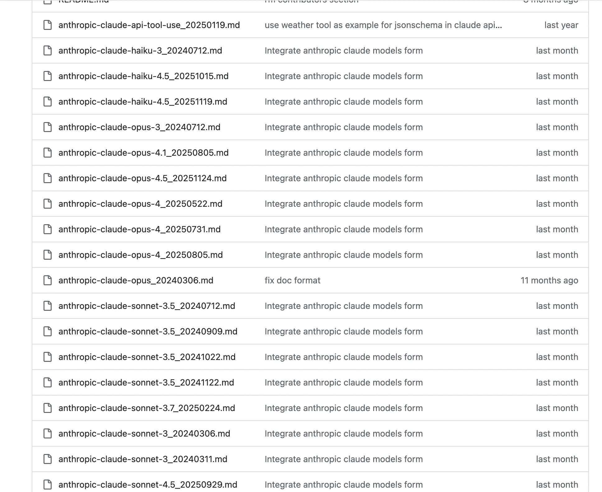
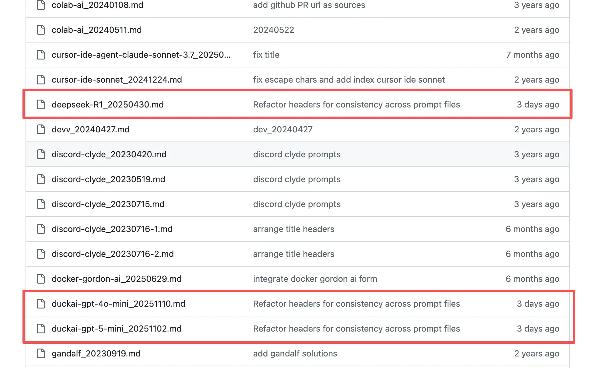

AI 能否按照你预期那样 “聪明” 地进行工作，除了模型本身的能力之外，最重要的就是提示词！

对于 AI 而言，它虽然有强大的推理能力、无人能及的训练数据以及巨量的信息储备，但是如果没有给它指定目标和引导，它充其量就是一个能快速给出回答的搜索引擎而已。

ChatGPT 3.5 刚出道的时候，这种感觉尤为明显。哪怕是现在，大多数人依旧是将 AI 当搜索引擎用。所以这在一定程度上会造成一种误解：AI 智能好像也没多智能。

但是在加入提示词之后，尤其是系统提示词，它带来的效果是非常显著的。

首先，对于系统提示词来说，它带给 AI 的，是一种身份赋予。这会注入职业、性格、喜好甚至情感给 AI，让它知道它后续需要以什么身份来和用户进行沟通。从哲学角度来看，解决了 “我是谁” 的问题；

其次，在用户提示词上，它会告诉 AI 用户的目标是什么。解决了 “做什么” 的问题。

二者结合之下，AI 的能力被释放，市面上逐渐出现了一些很牛的 AI 产品出来。比如 perplexity.ai、Brave Leo AI 等等。

而这些产品的系统提示词，目前均被收集到一款开源项目 Leaked-system-prompts 中，项目 star 已经到了 13.9k～

项目地址：https://github.com/jujumilk3/leaked-system-prompts

可以看到在上个月狠狠更新了一波 A 社 Claude 模型的系统提示词：

最近一次更新是三天前，更新了 DeepSeek R1 和 duckAI 的提示词：

虽然这些提示词对于我们而言无法直接使用（也说不好，一些第三方的中转站说不准能用），但是我们也可以从中取长补短，借鉴和学习他们的提示词是咋写的。

我们以 `anthropic-claude-opus-4.5_20251124` 的提示词为例来学习一下 A 社是如何写提示词的。

> 原提示词太长，大家感兴趣可以直接访问：https://github.com/jujumilk3/leaked-system-prompts/blob/main/anthropic-claude-opus-4.5\_20251124.md

从这份提示词来看，我们写提示词的核心要覆盖 8 个方面：

* **角色与身份**：明确模&#x578B;**“是谁”“以什么身份工作”**。
  * 让模型进入稳定心智模型；
  * 决定回答深度、视角、专业度；
  * 示例要素：“你是一名……”、“你以……身份思考和回答”。
* **能力边界与知识范围**：**明确模型能做什么、不能做什么**。
  * 减少幻觉；
  * 提升可信度；
  * 控制回答风险。
* **任务目标**：这是最重要的一点。**你希望模型最终“帮你达成什么结果”**。
  * 决定内容取舍；
  * 决定是否偏结论、过程、还是启发。
* **行为与价值约束**：不是安全合规那么重，但是要有**行为边界**。
  * 避免你不想要的输出；
  * 提高一致性；
  * 示例要素：不做什么，遇到灰区要如何处理。
* **推理方式**：即是否要求**分步骤、显式思考、给出权衡点和对立观点**。
  * 这是决定 **聪不聪明** 的观感。
* **语气与态度**：这会影响 **AI 输出的可读性以及是否“像人”**。
* **输出格式**：最立竿见影的一点。
  * 可以节省二次整理的成本；
  * 提升 AI 输出的稳定性；
  * 示例：是否使用列表、表格、是否限定长度、指定标签、Markdown 和 JSON 格式等。
* **交互策略**：可以决定模型是否主动补充、先给结论还是先澄清、是否提出改进建议。

总结起来就是：**好提示词 = 明确身份 + 明确目标 + 明确边界 + 明确表达方式。**

但是也要注意**好提示词 ≠ 长提示词。**
