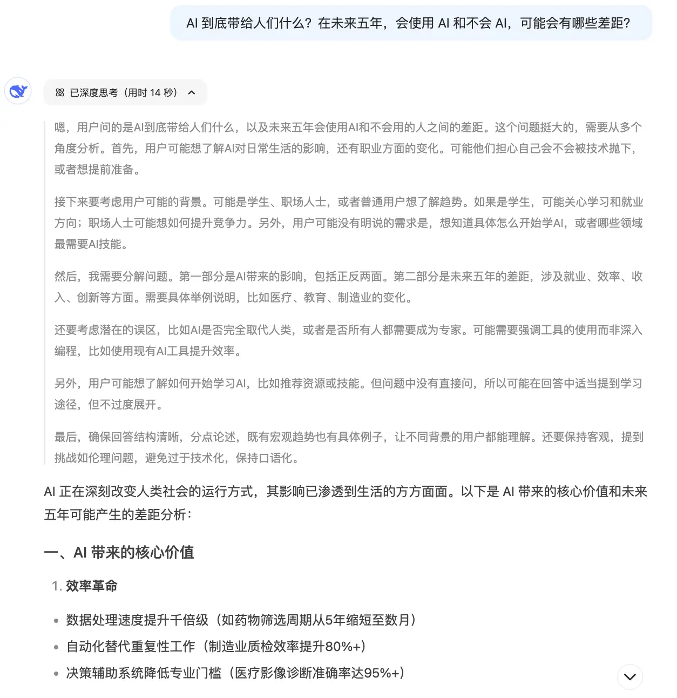

DeepSeek 从过年爆火至今，热度一直不低，各种免费或者付费的教程也是层出不穷。三金在阅读了大量的相关文章及教程之后，有一些感想今天拿来和大家唠唠。

本文的内容主要分以下几个方面：

* DeepSeek 相对于其他 AI 有哪些优势？
* 网上教大家本地部署 DeepSeek 的方法都有哪些？
* 不考虑数据隐私的话，没有必要本地部署 DeepSeek；
* 结合 AI 应用可以做哪些事情？（一些产品方向）

### DeepSeek 相对于其他 AI 有哪些优势？

具体来说应该是 DeepSeek R1 模型，它完全实现了**大模型思考**的能力。

当你在和 DeepSeek 聊天时它会把思考的过程也一起展示出来，就像是它在**揣摩你说的话到底是什么意思一样**，令人惊叹！

如图，DeepSeek 分析得头头是道，一些观点也给我带来了很大的启发，这个真的很惊艳。

我们在它分析及回答中还可以进行查漏补缺，看看自己的问题是否有缺失一些详细信息，从而导致 AI 的回答有些泛化。在下一次对话中补充缺失的细节，这样可以得到更加准确、更加贴切自己实际情况的回答。

比如在上图的分析中提到的：生活、职业、学习、就业，以及如何学习 AI，这些对于这个问题来说，肯定是提供得越详细越好。

虽然 DeepSeek 官网目前因为访问量过大经常会陷入系统繁忙的问题，但是在国内各大厂商也相继部署了 DeepSeek R1 的情况下这个问题已经得到了缓解，且大多数都是可以免费使用的。

这样一看，它的优势已经很明显了：

* **最大的亮点就是——思考分析**；
* 相比收费的 ChatGPT 的 o1，**免费**的 DeepSeek R1 明显技高好几筹；
* 在和 DeepSeek 的对话中，不仅仅可以获取答案，还可以跟 AI 学习如何思考和分析一件事、一个问题或者一句话。
* DeepSeek 和其他 AI 应用结合的情况下，可以大幅度提升这些应用的能力，对产品自身和对客户来说，都是好事。

### 网上教大家本地部署 DeepSeek 的方法都有哪些？

个人觉得本地部署大模型的场景有两种：

* 玩儿（😄）；
* 有私有部署的需求，不想泄漏内部资料。

网上教大家部署 DeepSeek 的文章有很多，但是不外乎以下几种方式：

* ollama：相关文章 [中文版斯坦福多智能体AI小镇（一）：安装 ](https://mp.weixin.qq.com/s/NqDsa7_eiP57Nf50xgP3dA)*[Ollama](https://mp.weixin.qq.com/s/NqDsa7_eiP57Nf50xgP3dA)**;*
* LM Studio 客户端：相关文章 [没有网络限制！超简单本地部署 Llama3 的方法](https://mp.weixin.qq.com/s/gD2Yjngrq5twDhMJnhkNuw?token=1351700674\&lang=zh_CN)；
* Jan 客户端：相关文章 [18k star 的开源本地部署大模型利器-Jan，支持启动本地服务](https://mp.weixin.qq.com/s/SPdog8WLlMYSSRTuixIZXQ)；
* Xinference：相关文章 [部署 4.8k star 的 ](https://mp.weixin.qq.com/s/5GTtPwpAm67XM37xCEDpHg)*[Xinference](https://mp.weixin.qq.com/s/5GTtPwpAm67XM37xCEDpHg)*[ 给知识库接入本地 Rerank 模型](https://mp.weixin.qq.com/s/5GTtPwpAm67XM37xCEDpHg)；
* vLLM
* 其他

对于小白用户来说，推荐 LM Stduio 和 Jan 客户端的方式，因为操作简单。

而对于有较高要求的用户，推荐使用 vLLM 的方式。

如果机器配置不太高，则可以选择使用 Ollama 和 Xinference 来进行部署。

### 非必要就别本地部署了

**简单点来说：机器不行、没数据隐私，折腾本地部署干啥，直接用现成的完全 OK。**

大多数情况下，我们部署的本地模型效果都差强人意，这是因为机器本身配置不高，根本带不动体量大的模型。所以我在文章开头也说了，如果没有数据隐私的问题，没有必要部署本地模型。

相反我们使用类似硅基流动提供的模型 API，不但响应快，有些模型还免费。即减轻了自己机器的负担，又能享受到 AI 带来的便捷。

在硅基流动中，提供了满血版的 DeepSeek R1 模型，也就是 671B 的模型，这个是收费的。不过我们可以通过邀请的方式来白嫖一段时间，每邀请一个人会有 14 块的额度。

且话说回来，对于普通人来说直接使用 671B 模型的场景很少见，我们可以视情况来选择合适的模型，比如 32B 或者 70B。

> 这里如果还没有使用过硅基流动的小伙伴可以点点三金的邀请码🤝：https://cloud.siliconflow.cn/i/BBj85fco

### 结合 AI 应用可以做哪些事情？

首先，对于 DeepSeek 来说基本上可以接入到大多数的 AI 应用中去。

只不过不同的应用需要选择相匹配的模型，比如你要用到 AI 编程，那你得用带 Coder 之类的模型，而如果是做规划师之类的，那你用 DeepSeek R1 也是没有问题。

三金这里结合之前介绍过的一些 AI 应用给大家分享一下：

* 做工作流：DeepSeek + Dify，关于 Dify 的部署安装可以参考 [37.4k 的 ](https://mp.weixin.qq.com/s/m7_AnblivDdHAasN09IWHw)*[Dify](https://mp.weixin.qq.com/s/m7_AnblivDdHAasN09IWHw)*[，一款小白也可以轻松上手的大模型开发平台（一）：部署及基础使用](https://mp.weixin.qq.com/s/m7_AnblivDdHAasN09IWHw)；
* 做知识库：DeepSeek + RAGFlow，关于 RAGFlow 的部署安装可以参考 [继 Dify 和 FastGPT 之后，我又玩了一下 ](https://mp.weixin.qq.com/s/9wx6jTCfq0QqW2AfVwJtTQ)*[RAGFlow](https://mp.weixin.qq.com/s/9wx6jTCfq0QqW2AfVwJtTQ)**；*
* 做知识库 + 工作流：DeepSeek + Dify + RAGFlow，关于如何在 Dify 中接入 RAGFlow 的知识库可以参考 [在 Dify 中接入 ](https://mp.weixin.qq.com/merchant/mppaysubscribe?action=go_paid_article\&article_url=https%3A%2F%2Fmp.weixin.qq.com%2Fs%2F4Ulz9duBu6f4Wp4skgP4OQ\&token=1351700674)*[RAGFlow](https://mp.weixin.qq.com/merchant/mppaysubscribe?action=go_paid_article\&article_url=https%3A%2F%2Fmp.weixin.qq.com%2Fs%2F4Ulz9duBu6f4Wp4skgP4OQ\&token=1351700674)*[ 的知识库](https://mp.weixin.qq.com/merchant/mppaysubscribe?action=go_paid_article\&article_url=https%3A%2F%2Fmp.weixin.qq.com%2Fs%2F4Ulz9duBu6f4Wp4skgP4OQ\&token=1351700674)；
* 做规划师：DeepSeek + AgenGPT，关于 AgentGPT 可以参考 [Docker 部署 30.5k 的 ](https://mp.weixin.qq.com/s/llXF3qVn9zE0ladtFj58uw)*[AgentGPT](https://mp.weixin.qq.com/s/llXF3qVn9zE0ladtFj58uw)*[，让 AI 帮你定制计划](https://mp.weixin.qq.com/s/llXF3qVn9zE0ladtFj58uw)；
* 做 AI 提示词：DeepSeek + Fabric，关于 Fabric 可以参考 [18.2k 的 ](https://mp.weixin.qq.com/s/f_TyOA1KaxzAkXlNl5oUxg)*[fabric](https://mp.weixin.qq.com/s/f_TyOA1KaxzAkXlNl5oUxg)*[，一款超强 AI Prompt 辅助](https://mp.weixin.qq.com/s/f_TyOA1KaxzAkXlNl5oUxg)；
* 做 AI 工程师：DeepSeek + MetaGPT，关于 MetaGPT 可以参考 [40.9k star 的 ](https://mp.weixin.qq.com/s/Teg6ULpiP4fcod-nK-Ngmw)*[MetaGPT](https://mp.weixin.qq.com/s/Teg6ULpiP4fcod-nK-Ngmw)*[，一个可以媲美完整开发团队的 AI 智能体](https://mp.weixin.qq.com/s/Teg6ULpiP4fcod-nK-Ngmw)；
* 做 AI 编程：DeepSeek + Cursor，没啥参考的，模型换一下即可；

有其他类似的 Case 欢迎大家补充在评论区～

