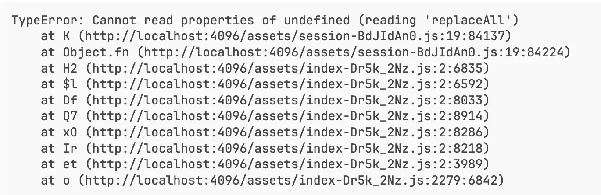
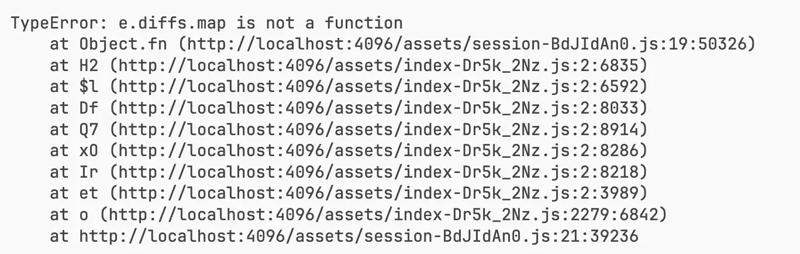
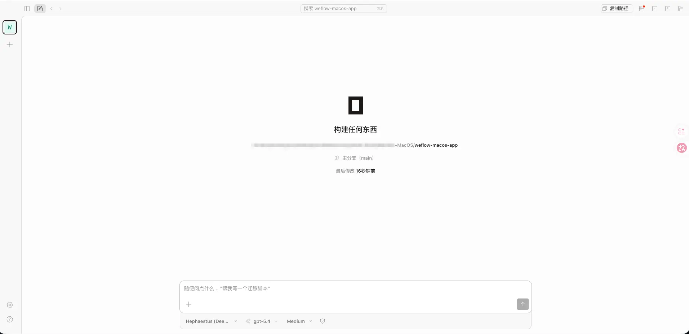
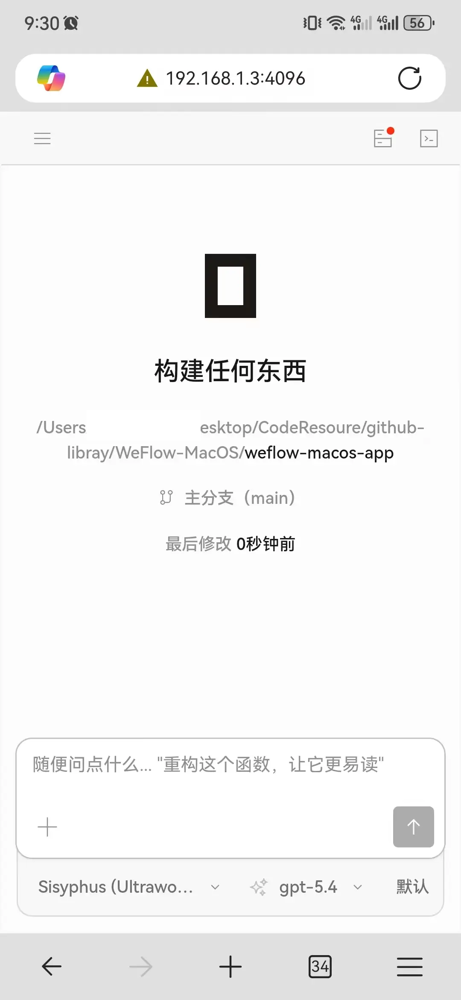

Hi，大家好，我是三金～

10 天前，OpenCode 官方 Web 出现了一个JavaScript Bug，用着用着突然就 G 了。





上 issue 看了下，有人提了 PR 修复，但是官方还没人合并，影响了起码好几个小时😂。

这让我想起前两天发的一篇关于 OpenCode 第三方 WebUI 的文章，当时评论区讨论还挺热闹的。

有喜欢用原装的，有在意是否可远程访问的，也有关注部署成本的，还有对第三方比较排斥的。在刚开始时，我感觉大家在意的并不是技术本身，而是**个人便好**，或者更准确一点地说，是**平时的使用习惯和具体场景**。

但在这次问题发生后，感觉还得再加一条：**当官方入口出了问题，还有没有别的方案做兜底？**

今天我们把这些问题重新捋一遍。

### 同一个 Serve

这是最容易忽略的事情，***不管你用的是官方 Web，还是 OpenCodeUI 这种第三方 Web，它们底层连接的都是同一个 OpenCode 能力层****。官方文档里的&#x20;**`opencode web`**、**`opencode serve`**、**`opencode attach`**，说的也是同一套服务能力，只是入口不同。*

在 OpenCodeUI 的 README 里也明确写着：

> *"A third-party Web frontend for OpenCode"*。

所以这里就不存在谁取代谁的问题，而是同一套能力，最后通过什么入口用起来更顺手。真正的差异，主要落在了界面、交互、部署形态、访问方式这些层面上。

白屏那几个小时，这个差异被放大了。

用官方 Web 的人，基本只有两条路：等修复，或者切换 TUI。而提前折腾过第三方的人，反而“逃逸”掉了这次问题，他们在这段时间里几乎没有感知——OpenCodeUI 连的是 `opencode serve`，有 bug 是官方 Web。

这不是在说第三方更好，而是说**单点依赖是有代价的**。

### 评论区的四类问题

围绕这些，就产生了四个反复被提及的问题，分别是：

* 重复造轮子
* 部署是否复杂
* 第三方跟不跟得上官方频率
* 天然不待见第三方产品

##### 重复造轮子

站在使用者的视角来看，手头已经有成熟工具了，再看到一个第三方产品时，第一反应大都是：这不是在浪费时间吗？

但是当我们站在开发者视角会发现，开源世界里很多“重复造轮子”的事情，本身就不是为了替代现有工具，也可能是在借这个过程理解设计思路、验证架构取舍，或者说在已有的基础上去做一些符合自身需求的“增强”。

所以大多数情况下，我们站在用户角度来说，好多开发者确实存在重复造轮子的行为，但用它来掩盖、抹去开发者本身的动机，就比较片面化了。

在当下，对于用户来说，关注点不再只聚焦在是否有某个能力，还有交互体验，说直白点就是容不容易上手、好不好看、是否可以傻瓜式操作以及是否满足用户当下的需求。

只要能满足上述特点，第三方就不再只是把一个东西换了层皮，而是在给另一类场景提供了入口。

##### 第三方部署是不是更复杂

这点毋庸置疑，很多场景下第三方确实更复杂。

官方 Web 最省事，就是直接跑一条 `opencode web`。后面无论是改端口、改 hostname，还是加认证，基本都还在官方给出的路径里操作。

而第三方这边，往往需要额外理解 `opencode serve`、CORS、托管前端地址、Docker、反代，甚至不同的设备之间应该如何接入。能做，但对于不了解这些的人来说，上手有难度。

但复杂并不等于没价值。它只是在说明：这类方案并不适合所有人，而是更适合那些明确需要远程访问、手机访问、PWA的人。你需要这些能力，就得接受多出来的部署和维护成本；你不需要，那就直接使用官方入口。

##### 跟不跟得上官方频率

其实这一点，对于处于 AI 时代的我们来说，完全是多余的。

因为像 OpenCodeUI 也是作者 Vibe Coding 的结果，要是真有一天作者不维护了，使用者自己 fork 一份过去继续维护也不是不行。最坏的情况还有官方方案做兜底，又不是整套东西都没法用了。

##### 天然不待见第三方

官方这个词，往往代表着强劲的公信力。从技术角度来说看：变量更少、兼容性预期更直接、出了问题也更容易排查，所以大家自然而然会更亲近官方出品。

这不是在否定第三方，而是因为这类用户更符合一种使用者画像：偏官方、偏统一入口、偏原装方案，对社区项目的容忍度会更低一点。

这是一种偏好差异，并不是无脑排斥。

### 到底怎么选呢？

其实看到这里，各位大概也能判断自己更适合哪种入口了。

如果你更在意原装、直接、少维护，那官方 Web 就是最合理的起点。`opencode web` 一条命令，理解成本和心理负担都最低。

如果你更在意某种特定的入口体验，比如：

* 远程访问
* 手机访问
* PWA
* 主题切换
* Docker 自托管
* **留一条备用入口**
* 等等

那第三方就有它存在的理由。它不是必须用，而是你在这些场景里会觉得更顺手、体验更好。

**脱离场景谈谁更好，最后大概率还是会聊成站队**。

### 官方 Web 用法补充

这里简单补充一下官方 Web 用法。

* 最简单的启动方式

```shellscript
opencode web
```



* 如果你想固定端口

```shellscript
opencode web --port 4096
```

* 如果你想让局域网里让别的设备也能访问

```shellscript
opencode web --hostname 0.0.0.0 --port 4096
```



* 如果要暴露到公网环境，一定要配合认证

```shellscript
OPENCODE_SERVER_PASSWORD=secret opencode web --hostname 0.0.0.0 --port 4096
```

* 另外，官方 Web 还能和 TUI 配合使用

```shellscript
opencode web --port 4096
opencode attach http://localhost:4096 # 注意这个地址换成 OpenCode 的服务地址
```

作用就是将终端 TUI 连接到已经运行的 OpenCode 后端服务器。让我们能够使用终端界面与远程 OpenCode 服务进行交互。

从上述内容来看，官方 Web 并不是一个很重的入口。对很多只想快速开始的人来说，是非常友好的新手入门入口。

### 最后

下次再有人问官方好还是第三方好，或者问有官方为什么还要第三方，我大概会反问：

* 你通常在哪里用？
* 用什么设备？
* 需要备用方案吗？

**因为答案在于自身需求，而非工具本身**。
