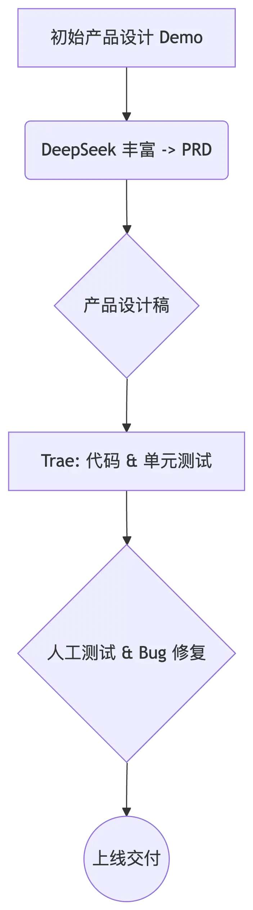

大家过年好！这里是三金～

过年三金本来准备弯道超车的，谁曾想弯道太冷给我整感冒了，到今天还处于急性支气管炎的状态，真的是无语极了！！😠

不过我还是强打起精神，使用字节的 Trae  AI 编辑器优化了我的两个项目：

* `tinify-webp`：一款终端工具，可以用来压缩图片，默认会将图片格式转换为 webp，也可以指定图片格式。测试效果很强！五百多 Kb 的图片压缩完之后只有 45 Kb！

* `md-note`：这是我 23 年的时候写的一款笔记应用，目前只有我自己在用。
  * 支持 Markdown 所见即所得；
  * 支持一键粘贴复制文章到微信公众号、知乎以及掘金；
  * 支持插入图片、视频，插入图片时会自动进行压缩转码；
  * 支持和一些开源的静态站点博客系统结合实现一键发布博客，比如 hexo、hugo 等；
  * 集成了一个 AI 功能，生成文章的 description；

tinify-webp 已经优化完并发布到 npm 上了，大家感兴趣可以试下，如上所说对于图片压缩的效果是非常惊人的！

笔记项目如今已经达到了上线的标准，不过我还想将其容器化一下，所以正式介绍它的时间会推后两天。

所以这次和大家主要会唠两方面的内容：

1. Trae 到底怎么样？
2. DeepSeek 如何和 AI 编程结合？

### Trae 到底怎么样？

其实从 Trae 诞生到现在，收获的赞誉和骂声都有。

* 有人夸赞它是国产 AI 编辑器之光，吊打 Cursor 和 Windsurf；
* 有人骂它的设计非常之稀烂，这里体验不好那里体验很差。

这两种观点是我看过的相关文章中最为极端的两种，不知道他们到底有没有实际使用 Trae 去做过东西，我觉得大概率没有，因为真正使用过它的人肯定知道：Trae 是好但是它还没成长到可以媲美 Cursor 和 Windsurf 的地步，它也有缺陷，但是也不至于说是稀烂。

只能说尬吹和诋毁在 AI 出世之后出现的频率已经到了烂大街的程度了，希望大家能擦亮眼睛，不要被这些信息所干扰。

我在假期这两天，一直在使用 Trae 做之前笔记项目的重构，实际体验下来，效果非常显著：

1. 使用 Builder 从 0 创建了一个 Vue3 的项目；
2. 按照之前的项目设计重新画 UI 页面以及写公共组件和方法；
3. 按照页面之间需要哪些公共变量又创建了 store 仓库统一进行管理；
4. 按照服务端提供的 API 二次封装了 axios 之后又在前端对 API 做了统一规划；
5. 前后端联调也是它做的；
6. 服务端优化重写了和 Github 之间如何进行交互；
7. 增加 AI 生成文章简介的功能。

结合过年大火的 DeepSeek，仅用了两天时间就让我的笔记项目焕然一新，整个过程没有产生一丝费用！

Trae 绝对称得上是我在过年期间的第一员工，白嫖 Claude-3.5-Sonnet 的感觉除了在 Cursor 上体验过之外，就属在 Trae 上使用起来最爽了！

* 首先，在使用上来说，你输入中文，它也能 get 到你想要的是什么，不必将你的想法翻译成英文发给它；
* 其次，Trae 也支持指定文件还是指定文件夹或者某一段代码；
* 除上之外，我们也可以上传图片，让 Trae 更加清楚我们的需求预期是什么，这里有些类似 dev0；
* 虽然没有 cursorrule 之类的，但是也能很顺畅得进行编码工作；
* 最最最主要的一点，到目前为止，Claude-3.5-Sonnet 免费用！这就相当于你手下有个很牛逼的编程大佬，只要你的需求是明确的，它就能给你实现，还不收你钱！
* 最后，我实际使用 Trae 完成了一个项目的重构，期间并没有遇到什么卡顿，有问题 Trae 也能即时进行解决和修复，所以它用实际行动证明了它作为 AI 编辑器的实力。

### DeepSeek 做方案师

这里并没有大家所期望的，有 DeepSeek 和 Trae 的高级用法，甚至对于 Trae 来说，目前还不支持 DeepSeek。

实际上刚开始的时候，我都是亲自上阵指导我的“员工” Trae 的，但是效率比较低，在 DeepSeek 爆火之后我就又将其“招募”在了旗下，开始帮我做一些扩展工作，比如：

* 让 DeepSeek 完善我的思路和想法；
* 有条理地、清晰地输出如何完成某个需求；
* 最后将整理好的内容发给 Trae 实现。

至此，效率提高了一大截，AI 输出的东西交给另外一个 AI 实现，二者的默契程度非常高，这不得不惊叹 DeepSeek 和 Claude-3.5-Sonnet （Trae 内置模型）的业务能力，它俩不愧是 AI 界数一数二的大模型。

DeepSeek 是真的能将你的想法分析得头头是道，并给出一个合理的解决方案，我再将这个方案发送给 Trae 之后，整个过程我只剩下验证了。

在整个过程中我只做拍脑袋的“老板”和测试，剩下的工作都由 DeepSeek 和 Trae 完成。

虽然如此，我还是有些不太满意，因为整个开发过程还是非常依赖人为因素，我所期望的理想状态是能有一个工作流来完成整个输出过程：

1. 输出初始的产品设计 demo 给 DeepSeek；
2. 然后 DS 在丰富之后生成可用的 PRD；
3. 再根据 PRD 能生成产品设计稿；
4. Trae 根据产品设计稿和 PRD 生成项目代码并执行代码单元测试；
5. 最后人为进行项目测试，找出 bug 再交给 Trae 进行修复；
6. 确认无误后上线交付。

如果能按照这个流程走，开发一款产品的效率会大幅提高，当然这其中也少不了专业人员的辅助，如果只是纯小白的话，还是比较吃力。

以上就是我最近做的一些事情以及想法，如果对大家有帮助还请一键三连～

