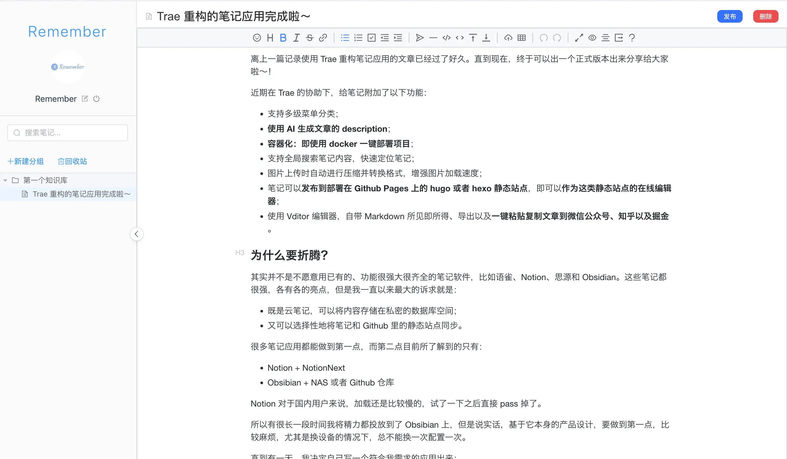
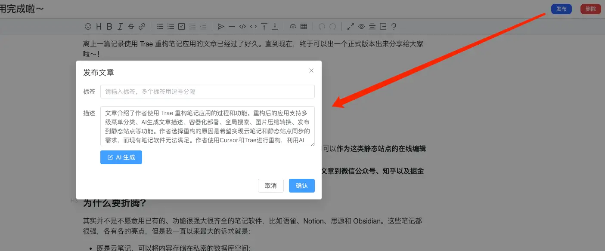

离上一篇记录使用 Trae 重构笔记应用的文章已经过了好久。直到现在，终于可以出一个正式版本出来分享给大家啦～！

近期在 Trae 的协助下，给笔记附加了以下功能：

* 支持多级菜单分类；
* **使用 AI 生成文章的 description**；
* **容器化：即使用 docker 一键部署项目**；
* 支持全局搜索笔记内容，快速定位笔记；
* **图片上传时自动进行压缩并转换格式，增强图片加载速度**；
* 笔记可以**发布到部署在 Github Pages 上的 hugo 或者 hexo 静态站点**，即可以**作为这类静态站点的在线编辑器**；
* 使用 Vditor 编辑器，自带 Markdown 所见即所得、导出以及**一键粘贴复制文章到微信公众号、知乎以及掘金**。

### 为什么要折腾？

其实并不是不愿意用已有的、功能很强大很齐全的笔记软件，比如语雀、Notion、思源和 Obsidian。这些笔记都很强，各有各的亮点，但是我一直以来最大的诉求就是：

* 既是云笔记，可以将内容存储在私密的数据库空间；
* 又可以选择性地将笔记和 Github 里的静态站点同步；
* 能在跨设备使用时，不重复进行配置。

很多笔记应用都能做到第一点，而第二点目前所了解到的只有：

* Notion + NotionNext；
* Obsibian + NAS 或者 Github 仓库。

Notion 对于国内用户来说，加载还是比较慢的，试了一下之后直接 pass 掉了。

所以有很长一段时间我将精力都投放到了 Obsibian 上，但是说实话，基于它本身的产品设计，要做到第一点，比较麻烦，尤其是换设备的情况下，总不能换一次配置一次。

直到有一天，我决定自己写一个符合我需求的应用出来：

* 它可以跑在云上，**只需要配置一次，任何设备都能访问**；
* 支持 Markdown 语法，而且需要所见即所得；
* **数据私有化，也可以作为静态博客的在线编辑器**；
* 具有笔记的基本功能：多级菜单、上传图片等等。

在 23 年的时候，花了半年左右完成了 `md-note` 项目，一个一直用到现在的笔记应用。它可以满足我的大部分需求，虽然也有缺陷存在，比如：

* 页面丑，这个真的是直接套上 ElementUI 前端组件框架就上的，只求快速出一个可以用的产品出来；
* 使用开源 Milkdown 编辑器，不过在文章内容上，会有一些限制，一些语法不支持，会导致解析错误。

但是这些缺陷是可以忍受的，毕竟它只有我一个人在使用而已。

直到 AI 的出现，给我又提供了使用 AI 进行重构的念头，故此第二版的笔记应用 `remember-note` 诞生了。

### 使用 Cursor 和 Trae

前期的时候，用了两天 Cursor，等免费体验时间到期之后，就又转到了 Trae 编辑器上。

因为模型都是 Claude 3.5，所以生产力也没下降，产出速度还是嘎嘎快，只需要输出给 AI 的指令足够明确，基本上给到我的代码都是可以直接跑通的，偶尔有一些 AI 理解不了的业务逻辑，人工花一点点时间就可以完美解决。

使用 Trae 重构进行重构时，我主要做了以下几件事：

* 给 Trae 直接将我之前的项目文档发给了它；
* 使用 Builder 模式，以之前的前端代码作为参考，重新使用 Vue3 来创建一个前端项目；
* 同上，服务端也让 Trae 重写了。

框架被 Trae 重写之后，事情就变得简单得多，因为前期喂过了文档，所以在将前后端项目跑起来之后，缺失哪些功能，让它按照文档描述添加上即可。

如果是隔了几天之后再进行开发，重新把文档内容给它投喂一次，或者将缺失功能的相关文档内容喂给它也可以。就这样断断续续一个多月，项目重构就搞好了。

接下来就是将上文中说到的两个缺陷做了一下优化和修复。

首先是页面样式，其实这一点的改变并没有达到我的预期，因为我并没有专门去做设计啥的，就是图方便，直接让 Trae 仿一下 Notion 的样式，左侧是菜单右侧是笔记主体区域，然后它就成了这样：

实际开始创建笔记并编辑的时候，还是 OK 的，Vditor 编辑器真的赞：

而因为使用了 Vditor 编辑器，所以之前 Milkdown 编辑器存在的语法限制也随之被解决（Vditor: 顺手的事儿），比如直接输入链接的时候，会导致编辑器报错从而渲染不出来内容。

发布功能就是和 Github 上的静态站点联动的入口，这里加了 AI 生成描述的能力。

为了方便部署，也让 Trae 为项目生成 Docker 相关的文件：

* 前端和服务端的 dockerfile 文件
* `docker-compose.yaml`
* 以及 `nginx.conf`

顺便也将一些状态作为环境变量提取到了 `.env` 文件中，比如 AI 配置、Github 仓库配置、OSS 配置（目前只用了阿里云）等等。详细配置可以移步到 [Github](https://github.com/foxhsx/remember-note)\~

至此，重构这活儿 99% 都被 Trae 干完了，我就负责测试即可，目前来看：

* 基本功能使用正常；
* AI 生成功能正常，需要自己配置 AI Key 和 url；
* 容器化也 OK；
* 数据备份需要配置阿里云 OSS；
* 将笔记同步到 Github 功能正常。

> ⚠️需要注意的是，因为笔记的图片是存储在部署应用的机器上的，所以图片地址也是云服务器的「IP/Url + 静态资源路径」

