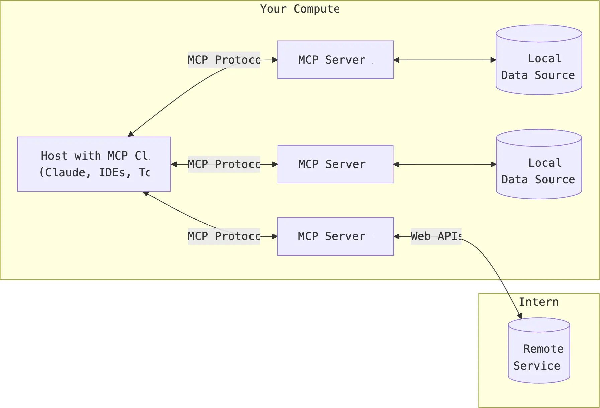
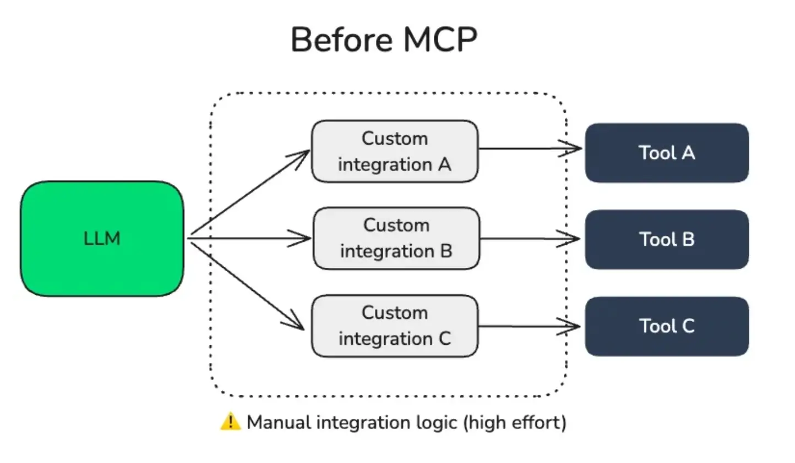
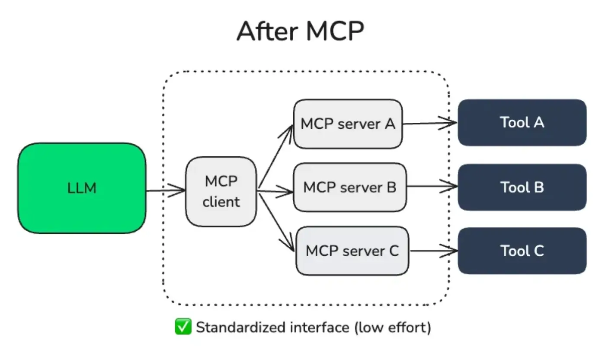

#### 什么是 MCP？

前段时间 MCP 大火，本来想乘着这个热度出几篇相关的文章来着，但由于种种原因被耽搁了，热度没蹭上😂。

不过也有好处，现在再来看 MCP，至少不会被热度牵着走。

去年十一月底 Anthropic （就是 Claude 那家 AI 公司）开源了 MCP 协议（Model Context Protocol），它是：

* **一个开放协议，像 AI 应用的 USB 接口一样**，规范了应用程序向 LLM 提供上下文的方式。
* 标准化的连接 AI 应用和不同数据源、工具之间的桥梁；
* 使开发者能够在其数据源和 AI 驱动的工具之间建立安全的双向连接；
* 目标是帮助前沿模型生成更好、更精准的响应。

简单来说，我们可以将其理解成**一个转接头，上面可以插网线、外接显示器、电源线、支持 USB 的其他设备等等**。

* 电脑就是 Host 主机，对应支持 MCP 的 AI 应用，比如 Cursor、Claude Desktop；
* 转接头就是 MCP，而转接头上的接口就是 MCP Client，和 MCP Server 保持一一对应的关系；
* 外接的移动硬盘、显示器、网线等等，就是 MCP Server。

#### 为什么需要 MCP？

需要知道的是，每个模型的训练数据是有差异的，而模型自身也无法自主去更新内部数据。

这就导致即使是最复杂的模型也因与数据隔绝而受到限制，最终被困在信息孤岛和遗留系统之中。

每个新的数据源都需要单独定制实现，这使得真正互联的系统难以扩展。

直到 MCP 的出现，以上问题被迎刃而解～

其实之前 OpenAI 曾推出 Function call 的概念，利用 Function call 我们可以打破 AI 模型与外界数据之间的壁垒，从而实现 AI 联网、访问天气等功能。

这也使得在 MCP 刚出来的时候，让我觉得 Function call 也能做到的事情为什么又要搞一个“相同”的东西出来？

等到 OpenAI 也使用这套协议并让它真正出圈时，才发现它并没有那么简单。

**首先**，我们已经说过，MCP 提供了一个通用的开放标准，用于连接 AI 系统和数据源，用单一协议取代分散的集成。

在 MCP 的架构设计中，主机（MCP 客户端的宿主机）应用可以连接到多个服务器：

> 这里解释几个概念：
> \- 主机是发起连接的 LLM 应用程序（如 Claude Desktop 或者 Cursor）；
> \- 客户端在主机内部和 MCP 服务器保持1-1连接；
> \- 服务器向客户端提供上下文、工具和提示；

**其次**，在 MCP 未出来之前，如果一个 AI 应用要接入一些工具，可能需要应用内部去做单独的适配，这会导致业务的复杂性和耦合性。

而在 MCP 出来之后，它通过统一的规范收敛了这种复杂性和耦合性：

* 工具方提供 MCP Server
* AI 应用内部使用 MCP Client 对接 Server

最后，也是最重要的一点，MCP 是一个协议，而不是 API。由它的全称就可以看出：Model Context Protocol——模型上下文协议。

它是以一个规范化、标准化的东西，而 API 则偏向客制化，如果发生变更很容易会导致对接方的功能失效。

MCP 还有三个核心类型的功能：**Tools**、**Resources 和 Prompts，**&#x8FD9;里不过多赘述，感兴趣可以访问它们的文档进行学习～

* MCP 文档：https://modelcontextprotocol.io/introduction
* 开源地址：https://github.com/modelcontextprotocol

> 参考文章：https://sutejakanuri.medium.com/what-is-mcp-d670dd7785c0

