### 1. Better Comments

[地址](https://marketplace.visualstudio.com/items?itemName=aaron-bond.better-comments)

让你的注释变得更加多彩的一款插件，可以根据不同的注释类型展示不同的颜色。

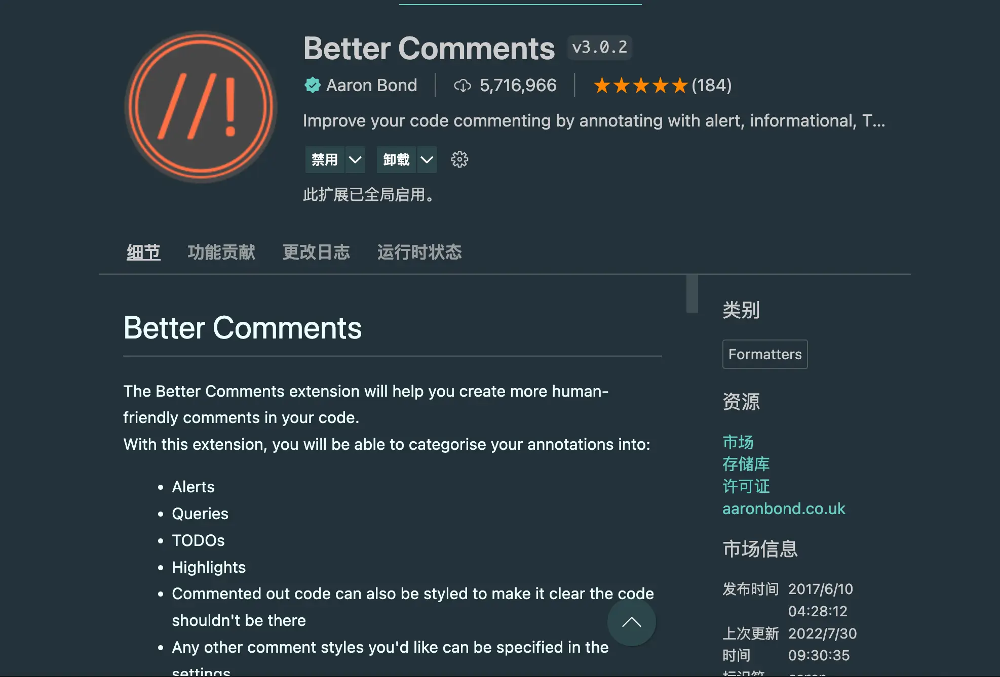

该插件自带有五种高亮的注释类型：

* 红色 - !
* 蓝色 - ?
* 绿色 - \*
* 橙色 - todo
* 普通注释 - //

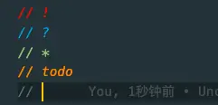

我们也可以自己添加一些注释类型，并设置颜色，具体步骤如下：

1. 打开 VSCode 左下角的设置
2. 然后点击设置界面右上角的文件图标，也就是 settings.json 文件
3. 在上一步的 json 文件中添加`better-comments.tags`属性，在这个属性里我们来增加自定义的一些注释。
4. 重启 VSCode 即可生效

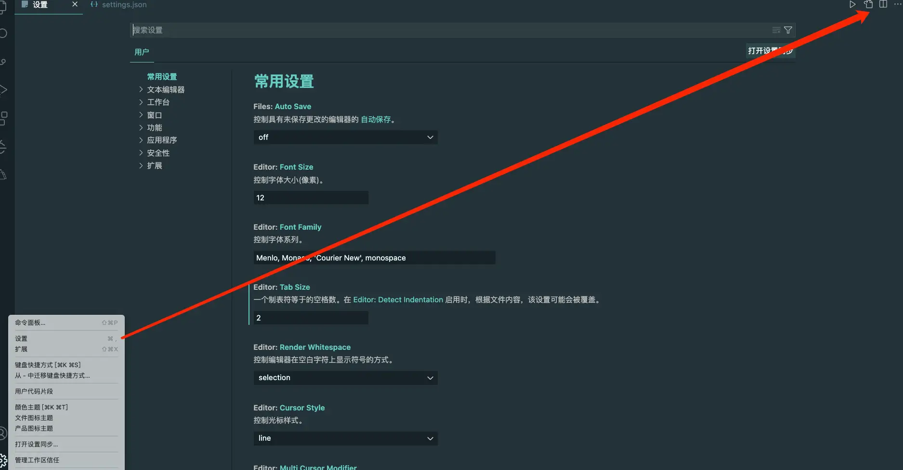

```json
{
  "better-comments.tags":[
        {
            "tag": "!",
            "color": "#FF2D00",
            "strikethrough": false,
            "underline": false,
            "backgroundColor": "transparent",
            "bold": false,
            "italic": false
        },
        {
            "tag": "?",
            "color": "#3498DB",
            "strikethrough": false,
            "underline": false,
            "backgroundColor": "transparent",
            "bold": false,
            "italic": false
        },
        {
            "tag": "//",
            "color": "#474747",
            "strikethrough": true,
            "underline": false,
            "backgroundColor": "transparent",
            "bold": false,
            "italic": false
        },
        {
            "tag": "todo",
            "color": "#FF8C00",
            "strikethrough": false,
            "underline": false,
            "backgroundColor": "transparent",
            "bold": false,
            "italic": false
        },
        {
            "tag": "*",
            "color": "#98C379",
            "strikethrough": false,
            "underline": false,
            "backgroundColor": "transparent",
            "bold": false,
            "italic": false
        },
        {
            "tag": "@",
            "color": "#eccccf",
            "strikethrough": false,
            "underline": false,
            "backgroundColor": "transparent",
            "bold": false,
            "italic": false
        }
    ]
}
```

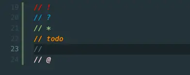

> 实际上除了颜色之外，我们可以看到还能设置：

* strikethrough：删除线
* underline：下划线
* backgroundColor：背景颜色
* bold：字体粗细
* italic：斜体

### 2. ESLint

ESLint 是用来检查我们代码语法及规范的检测工具，在 VSCode 中安装 ESLint 插件，可以减少开发当中的一些低级错误。

在安装好插件之后，它会先使用安装在打开的工作区文件夹中的 ESLint 库。如果没有，则向上查找全局安装的 ESLint。

但是假如你没有在本地或者全局进行安装，那么在使用前，还得需要安装一下。

* 本地安装：`npm i eslint -D`
* 全局安装：`npm i eslint -g`

在开发中使用时，还需要在根目录下新建`.eslintrc`文件来进行具体规范的配置。而这个文件要怎么配置，我们可以参考[官方文档](https://eslint.org/docs/latest/rules/)。

有些朋友在安装好插件之后，发现编辑器并没有像其他人的一样，给出提示，那是因为少配置了一些东西，我们同样打开 VSCode 的配置文件`settings.json`，然后设置以下几个属性：

* `eslint.probe`：这个配置项是用来设置哪些语言类型可以被插件校验并激活高亮错误的提示，现在默认有`["javascript","javascriptreact","typescript","typescriptreact","html","vue","markdown"]`
* `editor.codeActionsOnSave`：我们在保存代码时，编辑器会自动帮我们进行一些修复操作，我们在设置中搜索`codeActionsOnSave`就可以看到对应的配置项。

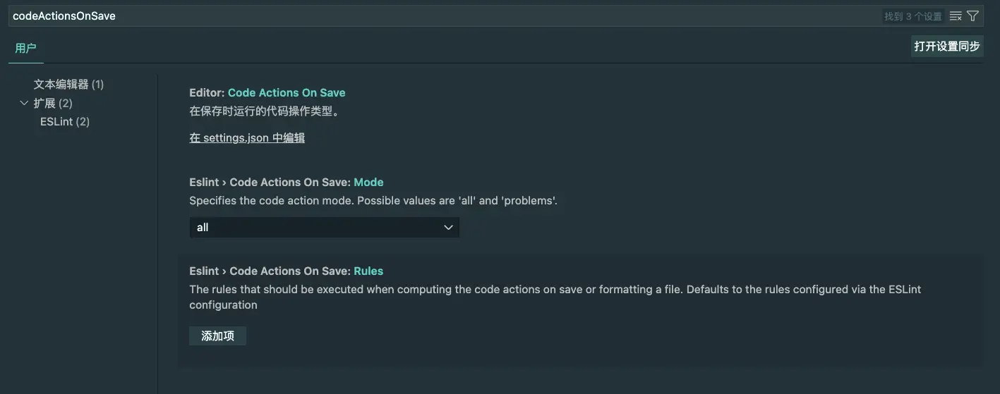

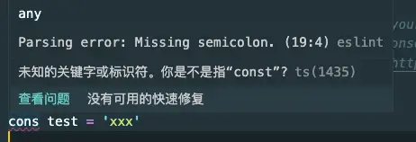

### 3. Live Server


简单点来说，它会提供一个本地开发服务器，当你安装好它之后，在编辑器的右下角的工具栏中会出现一个「Go Live」的按钮，点击这个按钮就可以启动一个本地服务。


然后，当我们修改 HTML、CSS 和 JavaScript 的时候，被打开的页面就会重新被加载。简单点来说它允许开发者在浏览器中实时预览正在编写的网页。

### 4. Turbo Console Log

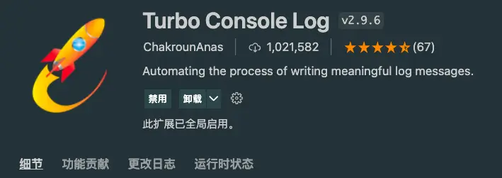

这是一个很棒的插件，它可以帮助我们自动生成 console.log，并携带文件名和行数，这样我们就可以清晰的分辨出来我们想要打印的日志是在哪个位置。

使用起来有两个步骤：

1. 选择或悬停将要打印的变量
2. Windows 电脑按下`Ctrl + Alt + L`，Mac 电脑按下`Ctrl + option + L`

然后在选中的变量的下一行就会被插入一条`console.log`。

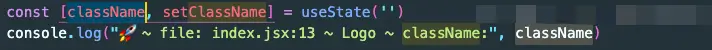

### 5. GitLens

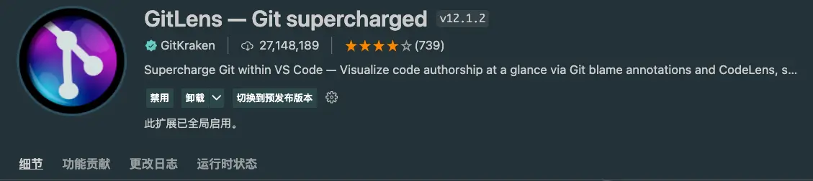

超级强大的一款 Git 相关的插件，在 VSCode 自带的 Git 功能的基础上增加了：

* Blame, CodeLens, and Hovers：在当前行的末尾以及状态栏上的标注信息，可以看到对应的历史记录，当我们将鼠标悬停在上面的时候，还可以看到一些详细信息

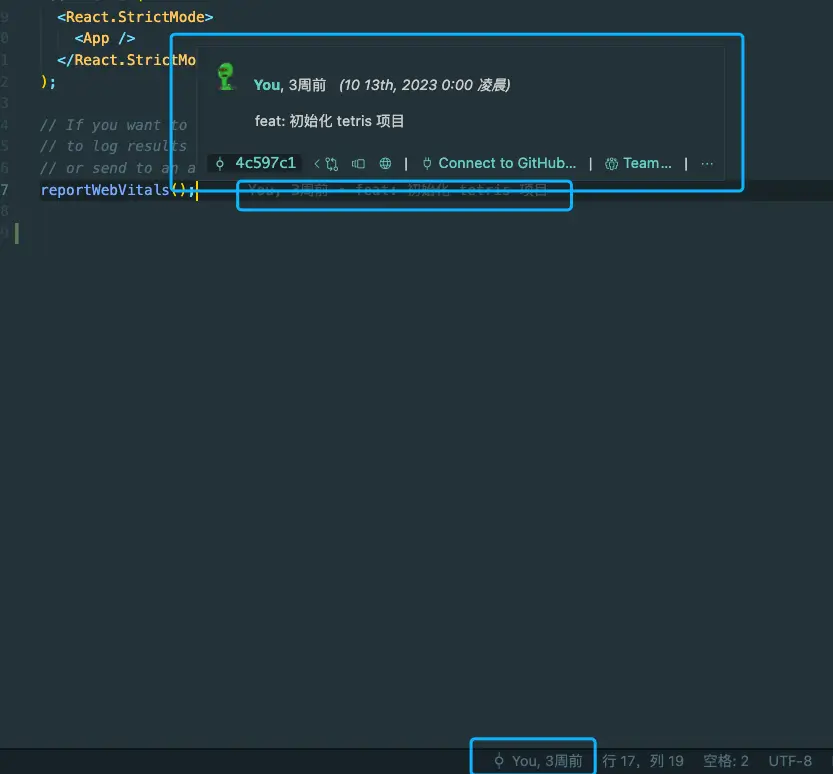

* 每个文件顶部和每个代码块的开头都提示最近的更改以及作者

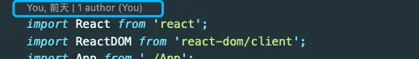

* 点击右上角的 「File Annotations」按钮，我们可以查看：
  * Blame annotations：当前文件中「谁写了哪一部分代码」；
  * Changes annotations：展示当前文件修改了哪些部分，在提交代码前，可以自行 Review；
  * Heatmap annotations：展示当前文件的

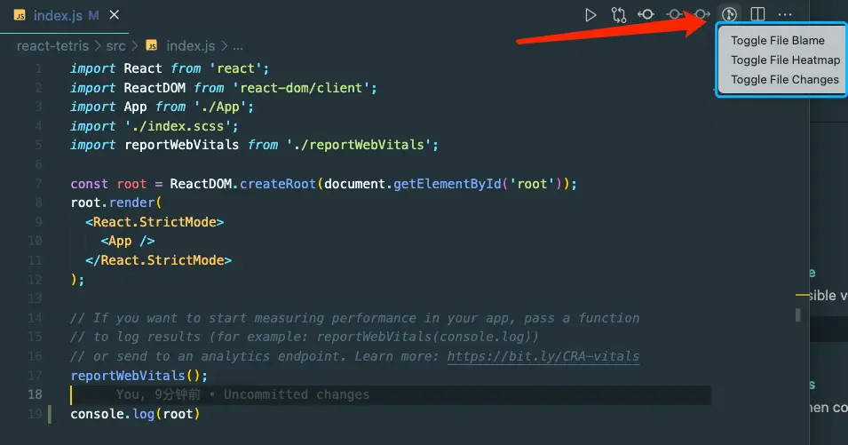

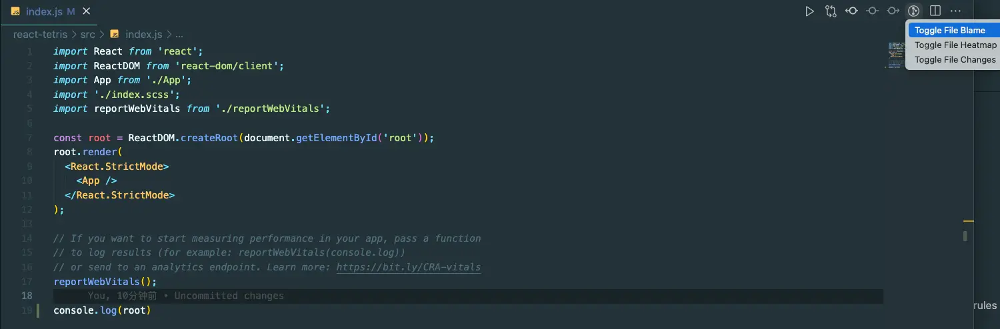

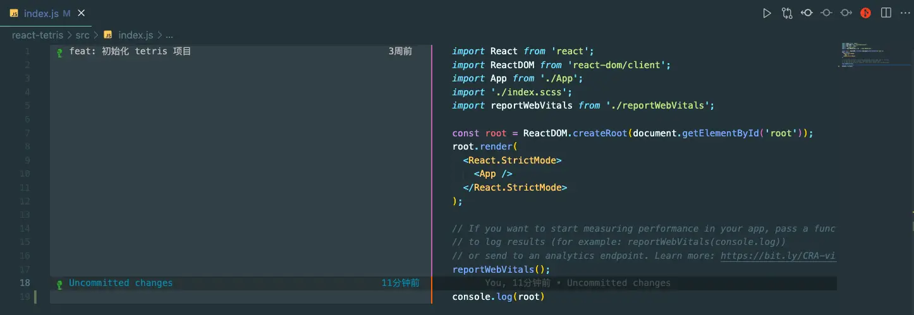

> 再次点击右上角已经变成红色的「File Annotations」按钮，即可恢复到编辑状态。

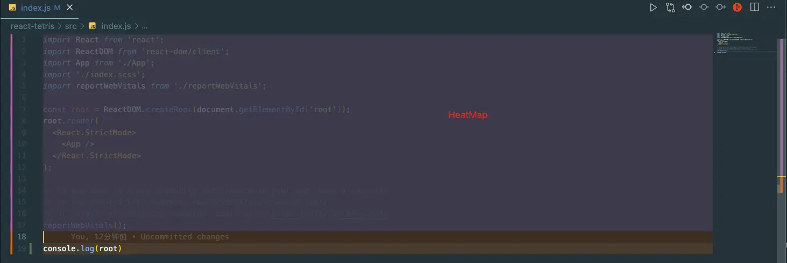

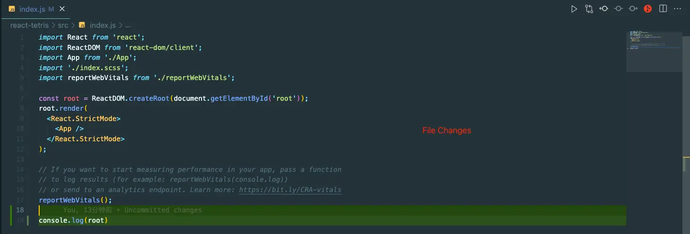

* Revision Navigation：快速查看当前文件的历史记录，并以 compare 的形式展示出来。

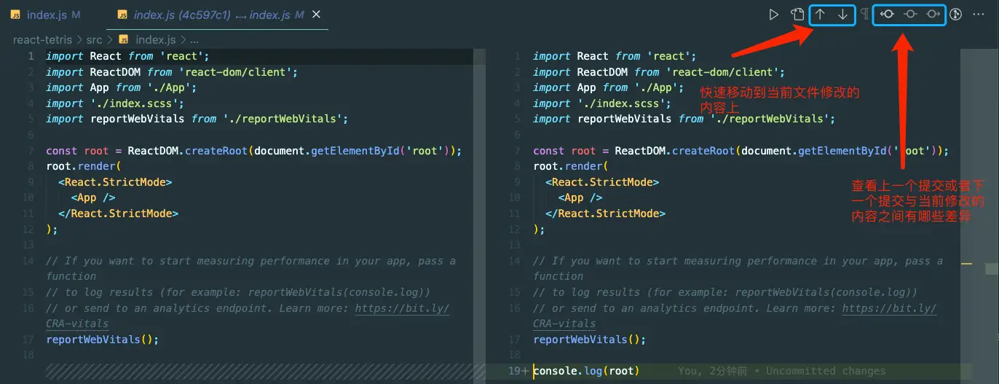

* 在 Git 工作区，还增加了一些其他的功能：
  * Commits：当前分支提交历史记录的列表，包括未推送的更改、上游状态、快速比较等。
  * File History：浏览文件、文件夹或选定行的修订历史记录。
  * Branches：管理和导航分支。
  * Remotes：管理和导航远程分支。
  * Stashes：保存和恢复当前尚未准备好提交的更改。
  * Tags：管理和导航远程打的 Tag。
  * WorkTrees：一个收费功能，感兴趣的可以自行了解。
  * Search & Compare：搜索和探索特定的提交、消息、作者、更改的文件，甚至特定的代码更改，或可视化分支、标签、提交等之间的比较。

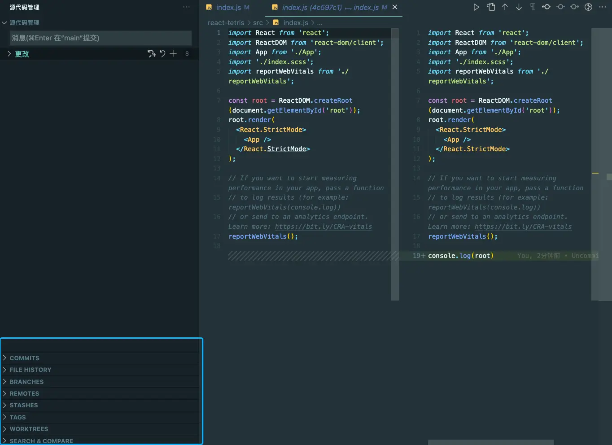

* 可以使用可视化的方式进行 rebase 操作
  * 将 VS Code 设置为默认 Git 编辑器：`git config --global core.editor "code --wait"`
  * 或者，如果只影响变基，请将 VS Code 设置为 Git 变基编辑器：`git config --global sequence.editor "code --wait"`
  * 当我们在终端执行`git rebase -i`\<your\_commitId> 时，我们就可以看到下图所示的画面

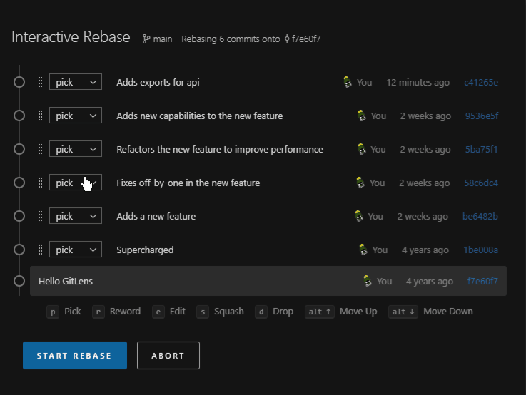

* 内置了丰富的命令，这样就不用担心没记住 Git 命令了。`option + command + G + 斜杠`

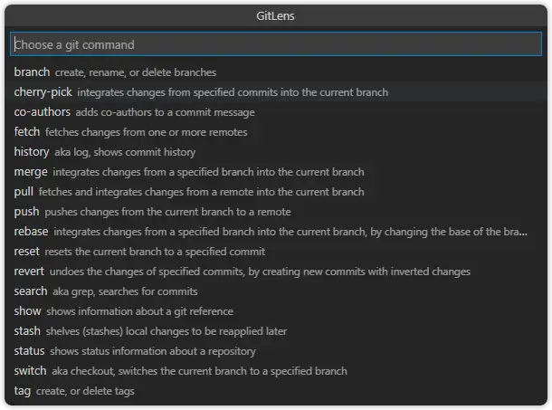

### 6. Git Graph

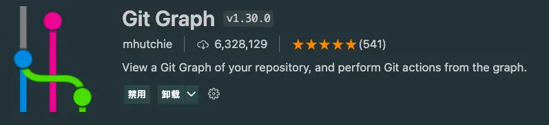

使用过 SourceTree 工具的同学都知道，该应用提供了强大的可视化查看存储库的 Git 操作，而`Git Graph`也和它一样，我们可以通过安装它来获得类似 SourceTree 的功能。

只需要在安装之后点击如下图所示中的按钮即可：

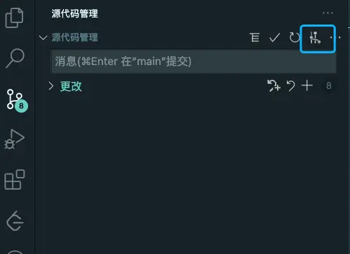

然后我们就可以通过这个可视化插件，进行更新和提交代码，查看提交历史等操作了。


> 实际上 Gitlens 中也有相似的功能，只不过它需要付费使用。

### 7. Prettier

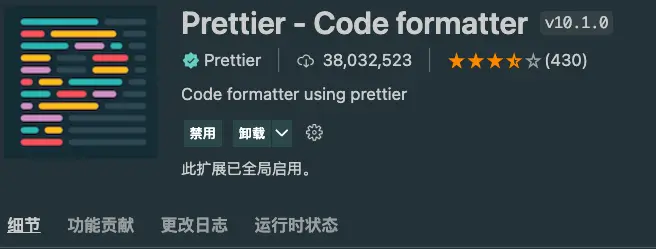

这是一款前端开发中常用的格式化代码的工具，目前支持：

* JavaScript
* React
* TypeScript
* json
* graphql
* handlebars

### 8. Code Snippets

代码片段类的插件有很多，比如：

* JavaScript (ES6) code snippets
* ES7+ React/Redux/React-Native snippets
* HTML Snippets
* Vue 3 Snippets
* ……

以`ES7+ React/Redux/React-Native snippets`为例：

1. 使用`CMD + Shift + R`快速唤出命令
2. 选择我们想要使用的 code snippets，比如 rafc

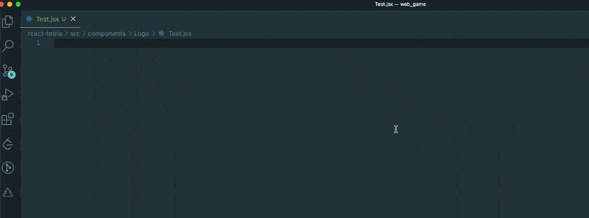

我们可以通过插件提供的快捷键，可以快速生成一些代码片段出来，这在开发中大大提高了开发效率。

以下是该插件中提供的 React Component 快捷键：

#### rafc

```typescript
import React from 'react'

export const $1 = () => {
  return <div>$0</div>
}
```

#### rafce

```typescript
import React from 'react'

const $1 = () => {
  return <div>$0</div>
}

export default $1
```

#### rmc

```typescript
import React, { memo } from 'react'

export default memo(function $1() {
  return <div>$0</div>
})
```

#### rmcp

```typescript
import React, { memo } from 'react'
import PropTypes from 'prop-types'

const $1 = memo(function $1(props) {
  return <div>$0</div>
})

$1.propTypes = {}

export default $1
```

其他 Code Snippets 的用法请自行查找哈。

### 9. Code Spell Checker

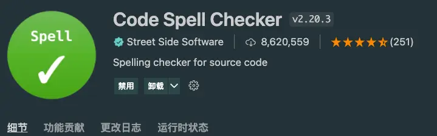

对于英语比较薄弱的小伙伴来说，这个插件真的是福音，它可以检查你的单词拼写是否有错误。

### 10. AI 提示类插件

* Tabnine

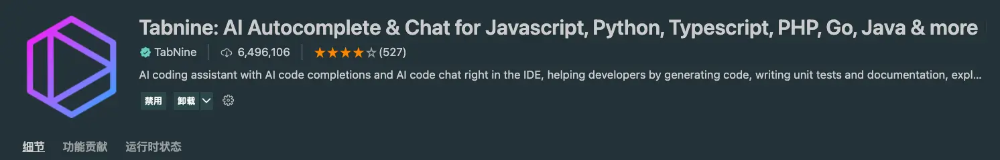

安装好之后，会提示需要我们登录，这个时候就要到 Tabnine 的官网注册账号然后登录了。我们可以使用 Github 账号进行登录。

登录好之后它会提示你：

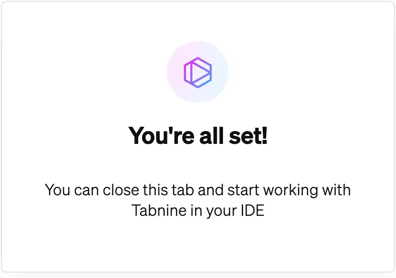

然后回到编辑器，在后面开发的时候，它就可以帮助我们进行一些智能提示了

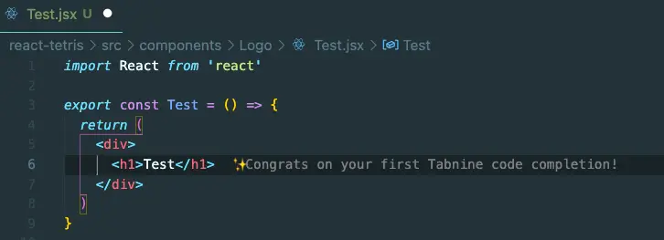

当然你也可以将自己想要的功能写在注释里，它会自动帮忙完成

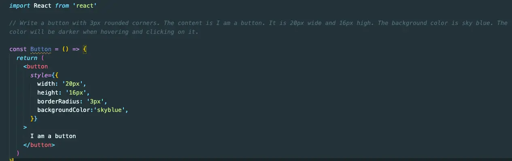

* 通义灵码

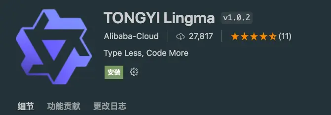

这是阿里巴巴刚出的新产品，在云栖大会上也是让人眼前一亮，不过我在安装的时候提示和当前的 VSCode 版本不兼容而导致安装不上，安装过的小伙伴可以在评论区分享一下。

### 11. Template String Converter

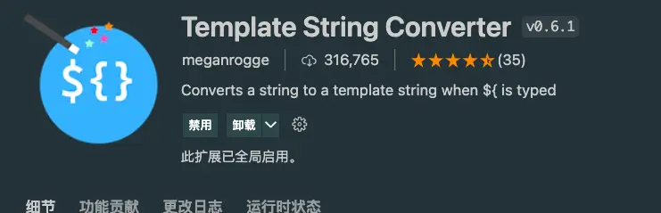

当我们在字符串中输入`${`的时候，这个插件会帮我们自动将该字符串转换为模板字符串。

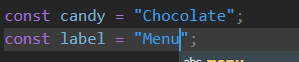

### 12. Git History

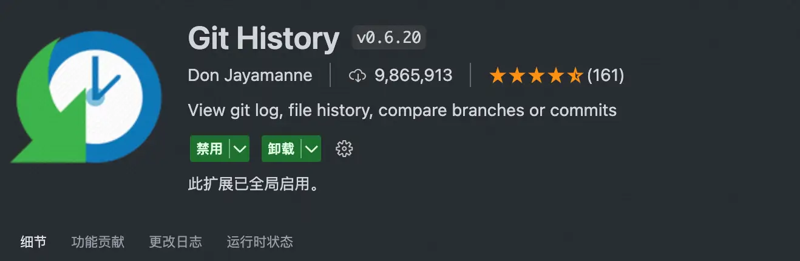

这个插件是用来查看当前文件的 Git 历史记录，并且它还具有比较文件版本的能力。在编辑器的右上角找到一个时钟的图标，那个是该插件的入口，点击之后会有一个简洁的界面来展示 Git 提交历史。


打开以后展示：

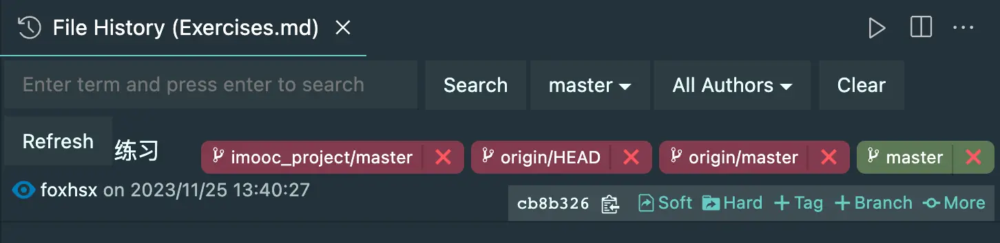

### 13. Auto Import

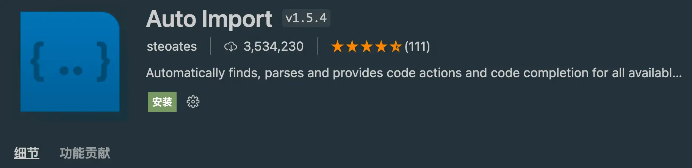

这个插件可以自动查找、解析并生成代码中正在使用的依赖路径。

### 14. Import Cost(Javascript and Typescript)

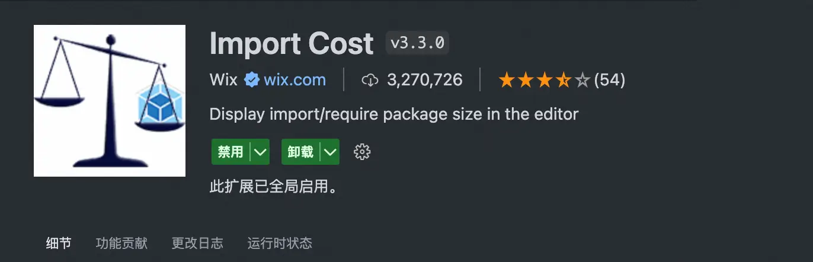

可以展示当前`import`或者`require`进来的包的大小。
