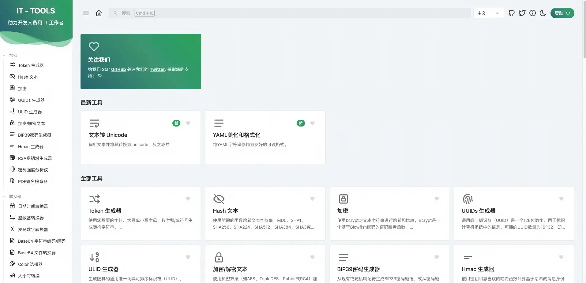

作为一个开发人员，在平时的开发中，可能需要用到很多工具来协助我们开发，比如：
<ul class="tight" data-tight="true" style="list-style-type: [object Object]"><li>
格式化 JSON 字符串
</li><li>
YAML 格式化
</li><li>
加密/解密文本
</li><li>
Base64 文件转换器
</li><li>
JSON 转 YAML
</li><li>
YAML 转 JSON
</li><li>
URL 解析器
</li><li>
JWT 解析器
</li><li>
JSON 差异对比器
</li><li>
文本比较
</li></ul>
等等等等，而这些都被集成到了 it-tools 里，我们可以选择在自己的服务器上使用 docker 快速一件部署，也可以直接使用原作者部署好的地址 <a target="_blank" rel="noopener noreferrer nofollow" class="link" href="https://it-tools.tech/">it-tools</a>。

接下来，我将介绍如何使用 docker、docker compose 和 k8s 来进行部署。
<blockquote class="blockquote">
这里我们在拉取镜像是时候，使用 nightly 分支，因为这个分支上有完整的中文，latest 上的中文，只有左上角的标题
</blockquote><h3>docker</h3><pre vnode="true" code="version: '3.9'
services:
it-tools:
image: 'corentinth/it-tools:latest'
ports:
- '3075:80'
container_name: it-tools
restart: unless-stopped" language="yaml" linenumbers="true" wordwrap="false" tabsize="2" shouldfocus="false"><code>version: '3.9'
services:
it-tools:
image: 'corentinth/it-tools:latest'
ports:
- '3075:80'
container_name: it-tools
restart: unless-stopped</code></pre><h3>k8s</h3><pre vnode="true" code="apiVersion: apps/v1
kind: Deployment
metadata:
labels:
app: it-tools
name: it-tools
namespace: default
spec:
replicas: 2
selector:
matchLabels:
app: it-tools
template:
metadata:
labels:
app: it-tools
spec:
containers:
- image: 'corentinth/it-tools:latest'
imagePullPolicy: Always
name: it-tools
restartPolicy: Always" language="yaml" linenumbers="true" wordwrap="false" tabsize="2" shouldfocus="false"><code>apiVersion: apps/v1
kind: Deployment
metadata:
labels:
app: it-tools
name: it-tools
namespace: default
spec:
replicas: 2
selector:
matchLabels:
app: it-tools
template:
metadata:
labels:
app: it-tools
spec:
containers:
- image: 'corentinth/it-tools:latest'
imagePullPolicy: Always
name: it-tools
restartPolicy: Always</code></pre>
以上每个标题对应不同的执行环境。

部署好之后即可输入公网IP+端口号进行访问了：

